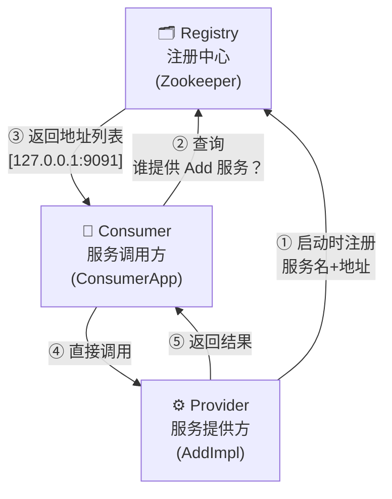
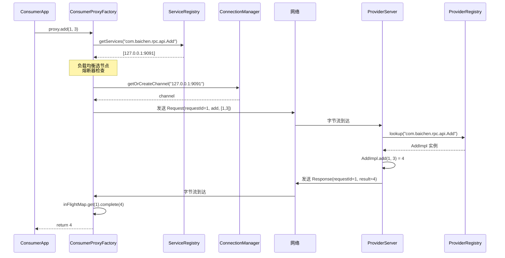

# 第 1 篇：全景篇 — 一次 RPC 调用的完整旅程

> 系列导读：本系列共 9 篇，用费曼学习法拆解一个从零手写的 RPC 框架。
> 这是第 1 篇，建立整体地图，后续每篇都在这张地图上标注位置。
>
> **系列目录**（持续更新）
> - **第 1 篇：全景篇 — 一次 RPC 调用的完整旅程**（本篇）
> - 第 2 篇：Netty 通信层 — NIO 模型与自定义协议
> - 第 3 篇：编解码 + SPI — 可插拔设计的正确姿势
> - 第 4 篇：服务发现 — Zookeeper 注册中心与缓存容错
> - 第 5 篇：连接管理 — 连接池与请求生命周期
> - 第 6 篇：负载均衡 + 重试 — 多节点下的请求路由
> - 第 7 篇：限流器 — 令牌桶算法与 CAS 无锁编程
> - 第 8 篇：熔断器 — 滑动窗口与三态状态机
> - 第 9 篇：降级 + 泛化调用 + 演进总结

---

## 什么是 RPC，为什么需要它

先从一个问题开始：两个程序，为什么不能直接调用对方的方法？

想象两个人在不同城市工作。张三在北京，李四在上海。张三想让李四帮自己查一份文件。如果他们在同一个办公室，张三走过去说一声就行了——这就是本地方法调用，简单直接，没有任何额外成本。

但他们在两个城市。张三没法直接走到李四旁边。他需要打电话：先拨号（建立连接），然后用语言把需求说清楚（把信息转化成可以传输的形式），李四听完之后去查文件，查到了再通过电话把结果告诉张三（结果传回来），张三挂断电话（连接关闭）。

这就是 RPC（Remote Procedure Call，远程过程调用）要解决的问题。

两个运行在不同机器上的程序，它们的代码和数据各自存在于自己的内存空间里，一方根本不知道对方内存里有什么。程序 A 不能凭空调用程序 B 的方法，就像张三不能直接走到李四的北京电脑前点击文件一样。

RPC 框架的价值，就是把这个"打电话"的过程完全藏起来，让程序 A 写代码的时候，感觉就像在调用一个本地方法一样，底下的拨号、通话、挂断，全都由框架自动完成。

---

## 架构地图：三个角色

这个 RPC 框架里有三个核心角色：**Consumer（调用方）**、**Provider（服务提供方）**、**Registry（通讯录）**。

```
                    ┌─────────────────────┐
                    │   Registry (ZK)     │
                    │   服务通讯录         │
                    │ "Add服务在哪里？"    │
                    │ → 127.0.0.1:9091   │
                    └──────────┬──────────┘
                    ①注册        ②查询
                    │            │
          ┌─────────┴─┐       ┌──┴──────────┐
          │  Provider │       │  Consumer   │
          │  服务提供方 │◄③调用─│  服务调用方  │
          │           │       │             │
          │  AddImpl  │─④结果►│  proxy.add  │
          │ add(1,3)=4│       │    = 4     │
          └───────────┘       └─────────────┘
```



**Provider（服务提供方）**：真正干活的一方。它在某台机器上启动，把自己能提供的服务（比如 `Add` 接口的实现）注册到通讯录里。当 Consumer 发来请求时，它接收、执行、返回结果。

**Consumer（服务调用方）**：需要使用远程服务的一方。它不知道、也不在乎 Provider 在哪台机器、哪个端口——这些都由框架处理。它只需要像调用本地方法一样写代码。

**Registry（服务通讯录）**：这个框架用的是 Zookeeper。Provider 启动时把"我在哪里"写进去，Consumer 要调用时先查一下"Add 服务在哪里"，然后再去找那台机器建立连接。它的核心价值是解耦：Provider 的地址可以随时变化，Consumer 不需要硬编码 IP。

这三者的关系是：Registry 是媒人，Provider 和 Consumer 通过它认识，之后直接对话。

---

## 一次完整调用：从 proxy.add(1,3) 到拿到 4

下面逐步拆解这一次调用的每个环节。结合源码，每一步都说清楚"谁做了什么，为什么这样做"。



### 第 1 步：Consumer 启动，建立代理对象

```java
// ConsumerApp.java
ConsumerProxyFactory consumerProxyFactory = new ConsumerProxyFactory(consumerProperties);
Add consumer = consumerProxyFactory.createConsumerProxy(Add.class);
```

Consumer 启动时，并不会立刻建立网络连接，只是创建了一个"代理对象"——`consumer` 这个变量，看起来是 `Add` 类型，但实际上是一个由 Java 动态代理机制生成的假对象。它内部没有任何 `add` 方法的真实实现。

为什么要用代理？因为我们想让调用者写 `consumer.add(1, 3)` 的时候感觉自然，但在这句话背后要偷偷做一堆网络传输的工作。代理就是那个"中间人"，拦截所有方法调用，把它们转成网络请求。

### 第 2 步：调用 proxy.add(1,3)，进入代理的拦截逻辑

```java
// ConsumerApp.java
System.out.println(consumer.add(1, 3));
```

这句看起来和普通方法调用没什么区别。但实际上，Java 动态代理机制会拦截这次调用，把执行权交给 `ConsumerInvocationHandler.invoke()` 方法。

```java
// ConsumerProxyFactory.java - ConsumerInvocationHandler
@Override
public Object invoke(Object proxy, Method method, Object[] args) throws Throwable {
    if (proxy.getClass().getDeclaringClass() == Object.class) {
        return handleObjectMethod(proxy, method, args);
    }
    // 执行 RPC 调用
    return invokeRemote(method, args);
}
```

`invoke` 方法接收三个参数：代理对象本身、被调用的方法（这里是 `add`）、调用参数（`[1, 3]`）。`method` 和 `args` 包含了我们后续需要告诉 Provider"要调用什么方法、传什么参数"所需的全部信息。

### 第 3 步：查询注册中心，找到 Provider 地址

```java
// ConsumerProxyFactory.java - invokeRemote()
String serviceName = interfaceClass.getName(); // "com.baichen.rpc.api.Add"
List<ServiceMateData> serviceMateDataList = 
    new ArrayList<>(serviceRegistry.fetchSeviceList(serviceName));
```

在发出网络请求之前，Consumer 要先知道"Add 服务跑在哪台机器上"。它拿着服务的全限定类名 `com.baichen.rpc.api.Add` 去 Zookeeper 查询，得到一个 `ServiceMateData` 列表，每个元素包含一个 Provider 实例的 `host` 和 `port`。

为什么用全限定类名作为 key？因为接口名是 Consumer 和 Provider 之间唯一共享的"契约"——只要双方都知道接口的全名，就能对上话。

### 第 4 步：负载均衡，选择一个 Provider 实例

如果有多个 Provider 实例（高可用部署），框架需要决定把这次请求发给谁。

```java
// ConsumerProxyFactory.java - decideService()
private ServiceMateData decideService(List<ServiceMateData> serviceMateDataList) {
    while (!serviceMateDataList.isEmpty()) {
        ServiceMateData select = balancer.select(serviceMateDataList);
        CircuitBreaker circuitBreaker = breakerManager.getOrCreateBreaker(select);
        if (circuitBreaker.allowRequest()) {
            return select;  // 这个节点正常，就选它
        }
        // 这个节点熔断了，跳过，选下一个
        serviceMateDataList.remove(select);
    }
    throw new RpcException("No more service to call");
}
```

这里还有一个重要逻辑：熔断检查。如果某个 Provider 实例最近频繁出问题，熔断器会把它标记为"暂时不可用"，负载均衡会跳过它。这保证了不会把请求往一个已知坏掉的节点上发。

### 第 5 步：打包请求，构建 Request 对象

```java
// ConsumerProxyFactory.java - buildRequest()
Request request = new Request();
request.setServiceName(interfaceClass.getName());  // "com.baichen.rpc.api.Add"
request.setMethodName(method.getName());            // "add"
request.setParamsClass(method.getParameterTypes()); // [int.class, int.class]
request.setParams(args);                            // [1, 3]
```

网络传输需要把"我要调用什么"变成一个可以发送的数据包。`Request` 对象就是这个数据包的内容——服务名、方法名、参数类型、参数值。特别是参数类型，是为了让 Provider 端能精确地通过反射找到正确的方法（Java 支持方法重载，同名方法可能有不同参数类型）。

每个 `Request` 还会自动生成一个唯一的 `requestId`：

```java
// Request.java
private Integer requestId = ADDER.getAndIncrement(); // 原子自增，全局唯一
```

这个 ID 有什么用？当多个请求同时在飞行中时，Provider 的响应会乱序到达。Consumer 凭借 `requestId` 把"这个响应是哪个请求的回答"对上号。没有它，就会出现"你问今天天气，我回答了股票价格"的混乱。

### 第 6 步：异步发送请求，注册等待回调

```java
// ConsumerProxyFactory.java - callRpcAsync()
private CompletableFuture<Response> callRpcAsync(Request request, ServiceMateData service) {
    // 先把这次请求"挂"在等待列表里
    CompletableFuture<Response> future =
            inFlightRequestManager.putRequest(request, service, properties.getWaitResponseTimeoutMs());

    // 获取到 Provider 的连接通道
    Channel channel = connectionManager.getChannel(service);

    // 把 Request 对象发出去（这里是真正的网络发送）
    channel.writeAndFlush(request).addListener(f -> {
        if (!f.isSuccess()) {
            future.completeExceptionally(f.cause());
        }
    });

    return future;
}
```

`channel.writeAndFlush(request)` 这一行是实际的网络发送动作。在发送之前，框架先在 `inFlightRequestManager` 里注册了一个"等待槽"——一个 `CompletableFuture`，专门等这次请求的响应。

整个过程是异步的：`writeAndFlush` 不会等到 Provider 回复才返回，它只是把数据塞进发送队列就返回了。真正等待的是后面的 `future.get(...)`。

### 第 7 步：Request 在网络上旅行，到达 Provider

在网络上传输的不是 `Request` 对象，而是它被编码后的二进制字节流。框架的编解码器（Encoder/Decoder）负责这个转换：`Request 对象 → 二进制字节 → 网络传输 → 二进制字节 → Request 对象`。

Provider 端的 Netty 收到字节数据后，`MessageDecoder` 把它还原成 `Request` 对象，交给业务处理 Handler。

协议帧结构（简化版）：
```
| Length(4B) | Magic(7B:"baichen") | Type(1B) | Version(2B) | SACType(1B) | Body(NB) |
```

Netty 的编解码细节（粘包处理、SACType 的高低位含义）将在第 2 篇详细展开，这里先知道"数据被打包成这样一帧字节"即可。

### 第 8 步：Provider 在本地注册表里找到服务实现

```java
// ProviderServer.java - ProviderServerHandler.channelRead0()
ProviderRegistry.InvokerInstance<?> invokerInstance = 
    providerRegistry.findInvokerInstance(req.getServiceName());
```

Provider 在启动时注册了服务：

```java
// ProviderApp.java
providerServer.register(Add.class, new AddImpl());
```

这相当于告诉框架："`com.baichen.rpc.api.Add` 这个服务，我用 `AddImpl` 来实现"。`ProviderRegistry` 维护着一张 `Map<接口全名, 实现实例>` 的对照表。收到请求时，拿出请求里的服务名，在这张表里一查，就找到了 `AddImpl` 的实例。

为什么要区分接口类和实现类？这是安全设计。`AddImpl` 可能还实现了其他接口、继承了其他类，有很多不想暴露给外部调用的方法。框架只通过接口类来查找可调用的方法，防止调用方绕过接口直接调用实现类上未在接口中声明的方法（如 AddImpl 里的私有方法）。

### 第 9 步：反射调用 add(1,3)，得到结果 4

```java
// ProviderRegistry.java - InvokerInstance.invoke()
public Object invoke(String methodName, Class<?>[] paramsClass, Object[] params) throws Exception {
    // 通过接口类查找方法（不是实现类，安全性考虑）
    Method method = interfaceClass.getDeclaredMethod(methodName, paramsClass);
    return method.invoke(instance, params);  // 真正的 add(1, 3)
}
```

Java 反射机制让我们可以在运行时通过"方法名 + 参数类型"来查找并调用方法，而不需要在编译时就知道要调用什么。这正是 RPC 框架的精髓——Provider 不需要知道 Consumer 会调用什么，只要对着接口"查表"执行就行。

`add(1, 3)` 的结果是 `4`，被包装成 `Response` 对象。

### 第 10 步：结果打包，原路传回

```java
// ProviderServer.java - InvokeThread.run()
Response response = Response.success(finalResult, req.getRequestId());
channelEventLoop.execute(() -> ctx.channel().writeAndFlush(response));
```

注意这里有个细节：`req.getRequestId()` 被原封不动地带进了 `Response`。这就是那个"回单号"——Consumer 收到响应后，靠这个 ID 找到对应的等待槽，把结果填进去。

### 第 11 步：Consumer 收到响应，Future 被唤醒

Consumer 端有一个 `ConsumerChannelHandler`（在 `ConnectionManager` 里），专门监听从网络上来的响应。收到 `Response` 后：

```java
// 找到对应的等待 Future，通知它"你要的结果来了"
inFlightRequestManager.completeRequest(response.getRequestId(), response);
```

此时，第 6 步里那个等待中的 `future.get(...)` 被唤醒了，拿到了 `Response` 对象。

### 第 12 步：提取结果，返回给调用方

```java
// ConsumerProxyFactory.java - invokeRemote()
Response resp = future.get(properties.getWaitResponseTimeoutMs(), TimeUnit.MILLISECONDS);
return postProcessResponse(resp); // 就是 resp.getResult()，即数字 4
```

`proxy.add(1, 3)` 返回了 `4`。`System.out.println` 打印出来。

从 Consumer 的视角看，这和调用一个本地方法没有任何区别。整个网络传输、查找服务、反射调用的过程，都被代理和框架完全隐藏了。

---

## 框架演进概览：v0.1 → v0.14

这个框架不是一次写成的，而是从一个最简单的原型逐步演进。每个版本都在解决一个具体的问题。

```mermaid
graph LR
    V1["v0.1<br/>基础通信"] --> V2["v0.2<br/>服务注册反射"]
    V2 --> V3["v0.3<br/>日志+超时+响应码"]
    V3 --> V4["v0.4<br/>连接池+requestId"]
    V4 --> V5["v0.5<br/>动态代理"]
    V5 --> V6["v0.6<br/>Zookeeper注册中心"]
    V6 --> V7["v0.7<br/>负载均衡"]
    V7 --> V8["v0.8<br/>重试机制"]
    V8 --> V9["v0.9<br/>限流器"]
    V9 --> V10["v0.10<br/>限流集成"]
    V10 --> V11["v0.11<br/>资源释放修复"]
    V11 --> V12["v0.12<br/>熔断器"]
    V12 --> V13["v0.13<br/>降级机制"]
    V13 --> V14["v0.14<br/>可插拔序列化/压缩"]

    style V1 fill:#e8f5e9
    style V14 fill:#e3f2fd
```



- v0.1：搭出骨架——基于 Netty 建立连接，自定义二进制协议（魔数防止粘包乱码），用 JSON 传递方法调用信息，打通第一次 RPC 调用。
- v0.2：服务端能找到实现类了——引入反射机制，Provider 根据请求里的方法名动态查找并调用服务实现。
- v0.3：加上基础设施——集成日志框架、增加响应码（200/400）、给 Consumer 加 3 秒超时，调用失败不再无限等待。
- v0.4：解决连接复用问题——引入 `ConnectionManager` 连接池，不再每次调用都新建连接；加入 `requestId`，支持同一连接上的多路复用。
- v0.5：让调用变透明——引入 Java 动态代理（`ConsumerProxyFactory`），Consumer 可以像调本地方法一样写代码，无需手动构建 `Request`。
- v0.6：去掉硬编码的服务地址——接入 Zookeeper 作为服务注册中心，Provider 自动注册，Consumer 动态发现；本地缓存保证注册中心宕机时仍可用。
- v0.7：支持多 Provider 实例——增加负载均衡（随机、轮询两种策略），一个服务可以部署多个节点，流量自动分发。
- v0.8：调用失败不放弃——增加重试机制（同节点重试、故障转移到其他节点、并行探测所有节点），引入指数退避避免雪崩；用 `HashedWheelTimer` 高效管理超时。
- v0.9：不让某个调用方压垮 Provider——实现令牌桶限流器和并发限流器，用 CAS 无锁算法保证高性能；修复了一个因 CAS 公式顺序错误导致时间窗口无法推进的严重 bug。
- v0.10：把限流接入调用链——将限流器集成到 Consumer 端（全局并发 + 单服务速率两级），超限时抛 `LimiterException`；抽取 `InFlightRequestManager` 统一管理请求生命周期。
- v0.11：修复资源泄漏——发现并修复超时场景下限流许可没有释放的问题；将 `ConnectionManager` 的生命周期管理规范化，支持优雅关闭。
- v0.12：自动识别"坏"节点——增加熔断器（基于响应时间的滑动窗口统计），慢请求比例超阈值时自动熔断，5 秒后半开探测，恢复后自动关闭。
- v0.13：调用失败有兜底——增加降级机制：优先返回缓存的上次成功结果（`CacheFallback`），缓存没有则走 Mock 实现（`MockFallback`）；所有节点熔断时触发降级而非直接报错。
- v0.14：让传输更灵活——协议升级，支持可插拔的序列化方式（JSON/Hessian 二进制）和压缩算法（GZIP/不压缩）；协议头新增版本号和序列化压缩类型字段；顺带修复了 GzipCompressor 的内存泄漏。

---

## 大白话总结

假设你开了一家餐厅，厨房在楼上，点菜台在楼下。顾客在楼下点菜，但做菜的师傅在楼上。

以前的做法是：每来一个顾客，服务员都要亲自跑到楼上问师傅会做什么菜、今天在不在，然后把顾客点的菜用纸条抄下来，爬楼梯送上去，等师傅做好了再端下来。

问题来了：
- 顾客点菜不知道师傅在哪，得现找
- 纸条没有编号，万一多张纸条一起送上去，师傅不知道哪道菜是哪桌的
- 师傅生病了，服务员还在往楼上跑，白等
- 顾客太多，服务员不够，全乱了

这个 RPC 框架就是给这家餐厅装了一套完整的"点菜-传单-出菜"系统：

1. **黑板（注册中心）**：师傅上班时把自己写上黑板"今天的张师傅在3号灶台"，服务员查黑板就知道去哪找，不用乱跑。

2. **点菜单（数据包）**：每张单子有编号、菜名、做法要求，楼上楼下对得上。

3. **传菜电梯（网络连接）**：建一条一直开着的电梯通道，不用每次爬楼梯。多张单子可以一起传上去，不堵塞。

4. **出菜号码牌（请求 ID）**：顾客点菜拿号，菜做好了广播号码，对上了才取菜，不会拿错别人的。

5. **黑名单（熔断器）**：张师傅今天状态太差，出了5道错菜，系统自动暂停发单给他，等他喝口水缓缓，再试着发一单看看行不行。

6. **备用方案（降级）**：厨房突然全停了，但冰箱里有昨天剩的熟食，总不能让顾客饿着，先端出来顶一下。

7. **门卫（限流器）**：门口来了太多人，餐厅坐不下，门卫让一部分人在外面排队，不能一股脑都进来，否则厨房会乱。

8. **外卖员选择（负载均衡）**：如果你有三个师傅，点菜台会轮流分配，不会把所有单子都压给一个人。

这个框架做的事就是这些——把两个"人"（程序）之间的协作变得自动、可靠、有条不紊，让每一方都只需要专注自己的事：厨师专心做菜，顾客安心点菜，中间的一切麻烦都由系统搞定。

---

*下一篇：第 2 篇 — Netty 通信层：NIO 模型与自定义协议*
