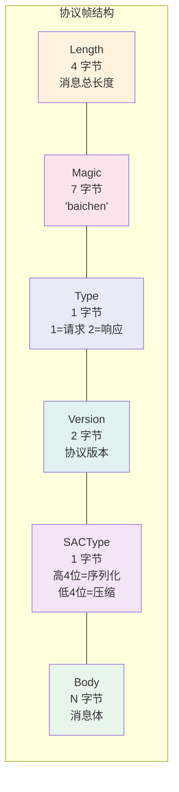
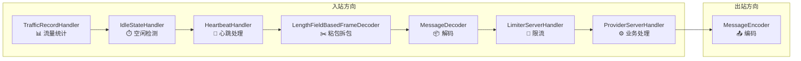
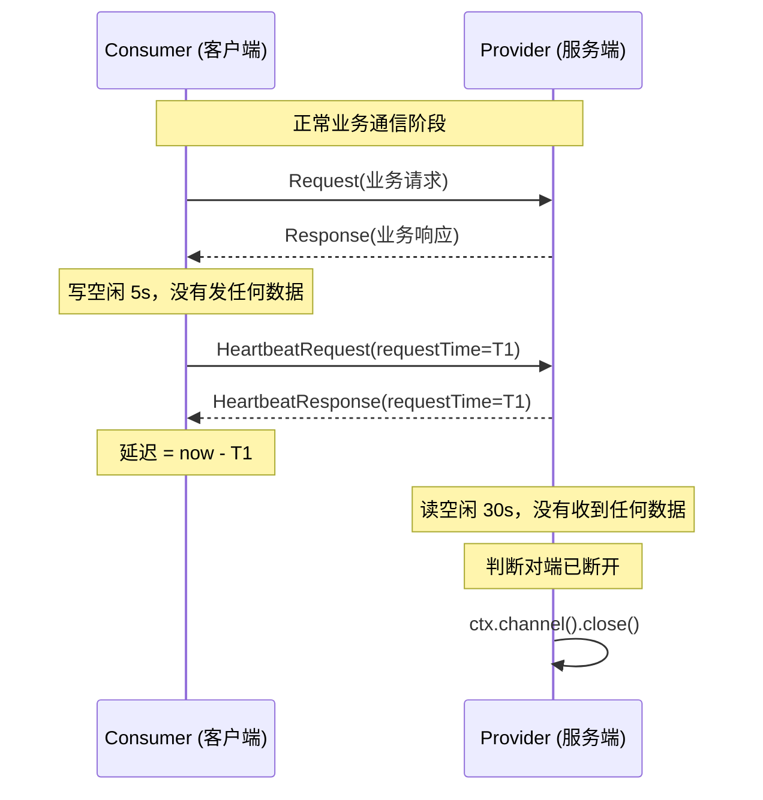

# 第 2 篇：Netty 通信层 — NIO 模型 + 自定义协议 + 心跳

> 上一篇建立了整体地图，知道了一次 RPC 调用经历哪些步骤。这一篇深入通信层：数据是怎么在网络上传输的？

---

## 为什么选 Netty：BIO vs NIO

在讨论 Netty 之前，先要回答一个更基础的问题：**服务端怎么同时处理很多客户端连接？**

### 传统方式：BIO（Blocking I/O）

想象一家餐厅，每来一桌客人，老板就专门分配一个服务员全程跟着这桌：点餐等服务员、上菜等服务员、买单等服务员。只要这桌客人在，这个服务员就不能去服务其他桌。

100 桌客人，就需要 100 个服务员。其中大部分时间，这些服务员都在"等待"——等客人看菜单、等厨房出餐，空耗人力。

这就是 BIO 模型：**一个线程对应一个连接**，连接不关闭线程就一直占着，即便绝大多数时候在等待数据到来什么都不做。服务器的线程数量有限，这种方式无法支撑大量并发连接。

### 改进方式：NIO（Non-Blocking I/O）

换一种餐厅模式：一个服务员在大厅里来回巡视，谁的杯子空了就去倒水，谁举手点菜了就去记单，谁要买单了就去结账。没有需求时，他就继续巡视。

这个服务员同时"服务"了所有桌，但只在有实际需求时才会停下来处理，效率高很多。

NIO 就是这个思路：**基于事件驱动**，一个线程可以监听多个连接上的 I/O 事件（有数据来了、可以写数据了等），只有真正有事件发生时才处理。

### Netty 的 EventLoop 模型

Netty 在 NIO 基础上进一步封装，引入了 **EventLoop** 概念。

```
bossEventGroup   ─── 1 个线程 ───► 专门接受新连接（相当于餐厅门口的迎宾）
workerEventGroup ─── N 个线程 ───► 每个线程管理多个连接的读写（相当于大厅服务员）
```

在本项目的 `ProviderServer.java` 中可以看到这两组的初始化：

```java
// bossEventGroup: 默认 1 个线程，只做一件事 —— Accept 新连接
bossEventGroup = new NioEventLoopGroup();

// workerEventGroup: 4 个线程，处理所有连接上的 IO 读写
workerEventGroup = new NioEventLoopGroup(properties.getWorkerThreadNum());
```

一旦新连接被 boss 接受，就交给 worker 中的某个 EventLoop 线程管理。此后这条连接上的所有 I/O 操作都由同一个线程处理，既避免了线程切换开销，又天然无锁。

Netty 帮我们把 NIO 的底层细节（Selector、SelectionKey、ByteBuffer）全封装掉了，我们只需要关心"收到数据后做什么""发数据前做什么"。

---

## 自定义二进制协议

两个程序通信，必须约定好"消息的格式"。就像寄信要有信封格式：收件人、发件人、邮政编码都有固定位置，邮局才能正确投递。

本项目定义了如下的二进制协议格式（来自 `MessageDecoder.java` 的注释）：

```
+----------+--------+----------+---------+---------+--------+
|  Length  |  Magic |   Type   | Version | SACType |  Body  |
+----------+--------+----------+---------+---------+--------+
|   4B     |   7B   |   1B     |   2B    |   1B    |  N B   |
+----------+--------+----------+---------+---------+--------+
```



结合 `Message.java` 的源码，逐字段解释：

| 字段 | 大小 | 含义 |
|------|------|------|
| **Length** | 4 字节（int） | 本条消息剩余部分的总字节数（不含 Length 自身） |
| **Magic** | 7 字节 | 魔数 `"baichen"`，协议身份标识 |
| **Type** | 1 字节 | 消息类型：1=Request，2=Response，3=心跳请求，4=心跳响应 |
| **Version** | 2 字节（short） | 协议版本号，当前为 V1 |
| **SACType** | 1 字节 | 高 4 位 = 序列化类型，低 4 位 = 压缩类型 |
| **Body** | N 字节 | 消息体，按 SACType 指定的方式编码 |

```java
// Message.java —— Magic 魔数定义
public static final byte[] MAGIC = "baichen".getBytes();  // 7字节

// SACType 的位运算拆解（MessageDecoder.java）
byte SACType = decode.readByte();
byte serializerCode = (byte) (SACType >>> 4);    // 高4位：序列化类型
byte compressorCode = (byte) (SACType & 0b00001111); // 低4位：压缩类型
```

用 1 个字节同时表达两种类型，是位运算的经典应用——高 4 位和低 4 位各独立编码，互不干扰。

---

### 设计追问

**Q1: 为什么要有 Magic 字段？如果没有会怎样？**

Magic 是协议的"暗号"或"握手口令"。

试想服务端监听的端口是公开的，任何人都可以向它发送数据。发来的数据可能是：
- 合法的 RPC 请求
- 另一个服务误发的数据
- 网络抖动产生的乱码
- 扫描端口的探测包
- 恶意构造的攻击数据

如果没有 Magic，服务端只能"硬着头皮"把收到的所有字节都当作合法请求去解析。遇到无效数据时，轻则解析出乱码结果，重则数组越界、类型转换异常，甚至导致整个服务崩溃。

有了 Magic 字段后，解码器第一步就做校验：

```java
// MessageDecoder.java —— 第一步就校验 Magic
byte[] bytes = new byte[Message.MAGIC.length];
decode.readBytes(bytes);
if (!Arrays.equals(bytes, Message.MAGIC)) {
    throw new IllegalArgumentException("魔数验证错误");
}
```

只要开头 6 个字节不是 `"baichen"`，立刻抛弃，后面的字节根本不读。这是一道廉价但有效的防线：计算成本极低，却能过滤掉绝大多数无效数据。

真实的 RPC 框架（如 Dubbo）也有同样设计，Dubbo 的 Magic 是 `0xdabb`。

---

**Q2: Length 字段为什么放最前面？和粘包有什么关系？**

要理解这个问题，先要理解 TCP 的本质。

TCP 是**流式协议**，它只保证字节流按顺序、可靠地到达对端，但**不保证消息边界**。也就是说：

- 发送方调用两次 `send()`，发送消息 A 和消息 B
- 接收方的一次 `recv()` 可能收到 `A`、`B` 合在一起的数据（**粘包**）
- 也可能只收到 `A` 的前半段（**拆包**），下次 `recv()` 才收到 `A` 的后半段加 `B`

用现实类比：就像往水管里倒水，不管你倒了几次、每次倒多少，从另一头接到的水是连续流动的，无法区分"哪些水是第一次倒的，哪些是第二次倒的"。

**Length 放最前面，是最经典的"定长帧头"解决方案**：

接收方的逻辑变成：
1. 先读 4 个字节，得到 Length = N
2. 再接着读 N 个字节，这就是一条完整的消息
3. 回到步骤 1，处理下一条消息

无论数据怎么粘包或拆包，这个逻辑都能正确地切割出完整的消息边界。

Netty 专门提供了 `LengthFieldBasedFrameDecoder` 来实现这件事，`MessageDecoder` 就继承自它：

```java
// MessageDecoder.java —— 构造函数，配置帧解码参数
public MessageDecoder() {
    super(
        MAX_FRAME_LENGTH,   // 最大帧长度：1MB，超过则拒绝
        0,                  // lengthFieldOffset：Length 字段从第 0 字节开始
        Integer.BYTES,      // lengthFieldLength：Length 字段占 4 字节
        0,                  // lengthAdjustment：长度值之后无需额外偏移
        Integer.BYTES       // initialBytesToStrip：跳过 Length 字段本身，正文从 Magic 开始
    );
}
```

父类处理完粘包/拆包后，`decode()` 方法收到的 `ByteBuf` 已经是**恰好一条完整消息**的字节，直接从 Magic 开始读就行了。

---

**Q3: Version 字段有什么用？**

Version 字段是**协议演进的安全阀**。

任何线上系统都会持续迭代，通信协议也不例外。比如：
- v1：只支持 JSON 序列化
- v2：新增 Hessian 序列化，性能提升 3 倍
- v3：新增请求追踪 ID，方便排查链路问题

问题在于，升级不可能一夜之间完成。线上可能同时存在：
- 旧客户端（只懂 v1）向新服务端（支持 v1/v2）发请求
- 新客户端（发 v2）向还没升级的旧服务端（只懂 v1）发请求

如果没有版本字段，服务端收到一个 v2 格式的消息，根本不知道这是新格式，只会按 v1 的方式解析，产生错误结果甚至崩溃。

有了 Version 字段，服务端可以：

```java
// MessageDecoder.java —— 版本校验
short version = decode.readShort();
if (version != Version.V1.getCode()) {
    throw new IllegalArgumentException("版本不匹配");
}
```

目前项目只有 V1，所以直接拒绝不匹配的版本。生产级框架会更灵活，根据版本号走不同的解析分支，实现平滑的协议升级。

---

## Netty Pipeline：请求的流水线

数据到达服务端后，需要经过一系列处理步骤。Netty 用 **Pipeline（管道）** 来组织这些步骤，每一步叫做一个 **Handler（处理器）**。

可以把 Pipeline 想象成工厂流水线：原材料（网络字节流）从入口进来，经过多道工序（Handler）加工，最终变成成品（业务处理结果）。

来看 `ProviderServer.java` 中实际的 Pipeline 组装代码：

```java
channel.pipeline()
    .addLast(new TrafficRecordHandler())          // 1. 流量记录
    .addLast(new MessageDecoder())                // 2. 解码：字节流 → Java对象
    .addLast(new MessageEncoder())                // 3. 编码：Java对象 → 字节流（出站方向）
    .addLast(new IdleStateHandler(30, 5, 0, TimeUnit.SECONDS))  // 4. 空闲检测
    .addLast(new HeartbeatHandler())              // 5. 心跳处理
    .addLast(new LimiterServerHandler())          // 6. 限流
    .addLast(new ProviderServerHandler());        // 7. 业务处理
```



### 为什么顺序很重要？

Pipeline 中的 Handler 是**有序的**，入站数据（收到的请求）从头到尾依次经过每个 Handler，出站数据（发送的响应）则反向经过。

**几个关键的顺序约束：**

1. **MessageDecoder 必须在业务 Handler 之前**：业务代码（`ProviderServerHandler`）期望收到的是已经反序列化好的 `Request` 对象，不是原始字节。如果先进业务 Handler，拿到的是 `ByteBuf`，根本无法处理。

2. **MessageEncoder 虽然是出站 Handler，也要在业务 Handler 之前添加**：在 Netty 的 Pipeline 模型中，出站 Handler 的执行顺序是从业务 Handler 往 Pipeline 头部方向走，所以 Encoder 要先注册才能正确拦截到业务 Handler 写出的响应。

3. **IdleStateHandler 必须在 HeartbeatHandler 之前**：IdleStateHandler 负责检测并触发空闲事件（`IdleStateEvent`），HeartbeatHandler 负责响应这个事件。如果 HeartbeatHandler 在前，事件还没产生就去监听，什么也收不到。

4. **HeartbeatHandler 必须在 LimiterServerHandler 之前**：心跳消息不应该消耗业务限流配额。如果让心跳包经过限流器，在高并发时心跳可能被限流拒绝，导致连接被误判为死连接而关闭。

---

## 编解码：MessageEncoder 和 MessageDecoder

编解码是协议的具体实现。**编码（Encode）** 把 Java 对象变成字节流准备发送，**解码（Decode）** 把收到的字节流还原成 Java 对象。

### 编码流程（MessageEncoder）

发送一条响应消息时，`MessageEncoder.encode()` 做了以下事情：

```java
// MessageEncoder.java —— 编码核心逻辑

// 第一步：确定消息类型码（REQUEST/RESPONSE/心跳）
Message.MessageType messageType = Message.MessageType.getByType(msg.getClass());
byte messageTypeCode = messageType.getCode();

// 第二步：序列化消息体（Java对象 → 字节数组）
byte[] body = defaultSerializer.serialize(msg);

// 第三步：判断是否需要压缩
// 小消息（<= 256字节）不值得压缩，压缩本身有开销
if (body.length <= 256) {
    serializeTypeCode &= (byte) 0xF0;  // 把压缩类型码清零，表示不压缩
} else {
    body = defaultCompressor.compress(body);  // 大消息才压缩
}

// 第四步：计算总长度（Magic + Type + Version + SACType + Body，不含Length自身）
int length = magic.length + 2 * Byte.BYTES + Short.BYTES + body.length;

// 第五步：按协议格式依次写入 ByteBuf
out.writeInt(length);       // Length：4字节
out.writeBytes(magic);      // Magic：7字节 "baichen"
out.writeByte(messageTypeCode);  // Type：1字节
out.writeShort(version);    // Version：2字节
out.writeByte(serializeTypeCode); // SACType：1字节
out.writeBytes(body);       // Body：N字节
```

注意第三步的优化细节：小消息（如简单的心跳包、短字符串响应）序列化后本来就很小，再压缩不但省不了多少空间，还要额外付出 CPU 计算代价。只有消息体超过 256 字节，压缩才划算。

### 解码流程（MessageDecoder）

收到数据时，`MessageDecoder.decode()` 做了以下事情：

```java
// MessageDecoder.java —— 解码核心逻辑

// 第一步：调用父类（LengthFieldBasedFrameDecoder）处理粘包/拆包
// 父类保证：decode 拿到的 ByteBuf 是恰好一条完整消息（已去掉 Length 字段）
ByteBuf decode = (ByteBuf) super.decode(ctx, in);
if (decode == null) {
    return null;  // 数据还不完整，等待更多字节到来
}

// 第二步：校验 Magic
byte[] bytes = new byte[Message.MAGIC.length];
decode.readBytes(bytes);
if (!Arrays.equals(bytes, Message.MAGIC)) {
    throw new IllegalArgumentException("魔数验证错误");  // 不是我们的协议，丢弃
}

// 第三步：读取元数据字段
byte messageTypeCode = decode.readByte();           // Type
Message.MessageType messageType = Message.MessageType.getByCode(messageTypeCode);
short version = decode.readShort();                 // Version
if (version != Version.V1.getCode()) {
    throw new IllegalArgumentException("版本不匹配");
}

byte SACType = decode.readByte();                   // SACType
byte serializerCode = (byte) (SACType >>> 4);       // 高4位：序列化类型
byte compressorCode = (byte) (SACType & 0b00001111); // 低4位：压缩类型

// 第四步：读取消息体，先解压，再反序列化
byte[] body = new byte[decode.readableBytes()];
decode.readBytes(body);
byte[] decompress = compressor.decompress(body);    // 解压（如果压缩过）
return serializer.deserialize(decompress, messageType.getType()); // 反序列化为Java对象
```

整个解码流程可以概括为：**先拆帧（父类负责），再验身（Magic），再读头（Type/Version/SACType），再还原体（解压+反序列化）**。每一步都有明确的职责，互不越界。

---

## 心跳机制：连接保活

网络连接是有"寿命"的。即使双方都没有主动断开，连接也可能因为各种原因悄悄地"死掉"了，而两端都不知情。心跳的作用就是**定期证明"我还活着"，同时检测对方是否还活着**。

### 心跳的完整流程

`HeartbeatHandler.java` 结合 `IdleStateHandler` 实现了完整的心跳机制：

**触发条件（IdleStateHandler 配置）**：
```java
// ProviderServer.java
.addLast(new IdleStateHandler(30, 5, 0, TimeUnit.SECONDS))
//                             ^    ^   ^
//                    读空闲30s  写空闲5s  全空闲不检测
```

- **写空闲 5 秒**：5 秒内没有向对端写入任何数据，触发 `WRITER_IDLE` 事件
- **读空闲 30 秒**：30 秒内没有收到对端任何数据，触发 `READER_IDLE` 事件

**处理逻辑（HeartbeatHandler）**：

```java
// HeartbeatHandler.java —— 空闲事件处理
@Override
public void userEventTriggered(ChannelHandlerContext ctx, Object evt) throws Exception {
    if (evt instanceof IdleStateEvent idleStateEvent) {
        switch (idleStateEvent.state()) {
            case WRITER_IDLE -> {
                // 写空闲：我很久没说话了，主动发一个心跳，告诉对方"我还活着"
                log.info("{} 写空闲事件触发", ctx.channel().remoteAddress());
                ctx.writeAndFlush(new HeartbeatRequest());
            }
            case READER_IDLE -> {
                // 读空闲：对方很久没说话了，可能已经挂了，关闭连接释放资源
                log.info("{} 读空闲事件触发，关闭连接", ctx.channel().remoteAddress());
                ctx.channel().close();
            }
        }
    }
    ctx.fireUserEventTriggered(evt);
}

// 收到消息时的处理
@Override
protected void channelRead0(ChannelHandlerContext ctx, Object o) throws Exception {
    if (o instanceof HeartbeatRequest request) {
        // 收到心跳请求：立即回复一个心跳响应
        ctx.writeAndFlush(new HeartbeatResponse(request.getRequestTime()));
        return;  // 心跳消息到此为止，不传给后续 Handler
    } else if (o instanceof HeartbeatResponse response) {
        // 收到心跳响应：计算延迟，记录日志
        long latency = System.currentTimeMillis() - response.getRequestTime();
        log.info("{} 心跳响应，延迟 {} ms", ctx.channel().remoteAddress(), latency);
        return;  // 心跳响应到此为止，不传给后续 Handler
    }

    // 非心跳消息，交给后续的业务 Handler 处理
    ctx.fireChannelRead(o);
}
```

整个心跳流程如下：

```
[客户端] 5秒内没发任何数据
         → IdleStateHandler 触发 WRITER_IDLE 事件
         → HeartbeatHandler 发送 HeartbeatRequest

[服务端] 收到 HeartbeatRequest
         → HeartbeatHandler 回复 HeartbeatResponse

[客户端] 收到 HeartbeatResponse
         → 记录延迟日志，这次心跳完成

[任意一方] 30秒内没收到任何数据（包括心跳）
           → IdleStateHandler 触发 READER_IDLE 事件
           → HeartbeatHandler 关闭连接
```



---

### 设计追问

**Q4: 为什么要有心跳？TCP 自己不会检测连接断开吗？**

TCP 协议确实有一个叫 `keepalive` 的机制，但它有两个致命弱点：

**弱点一：太慢。** Linux 系统的默认配置是：连接空闲 **2 小时**后才开始发探测包，发 9 次，每次间隔 75 秒，全部失败才认定连接断开。对于 RPC 框架来说，发现一条死连接最多要等将近 2 小时，这期间请求都会失败，完全不可接受。

**弱点二：防火墙和 NAT 会悄悄关闭空闲连接。** 企业网络中普遍存在防火墙和 NAT 设备，它们会维护一张"活跃连接表"。如果一条 TCP 连接长时间没有数据流动，这些设备会悄悄把它从表中删除，释放资源。此时 TCP 两端都以为连接还在，但数据其实已经无法送达了——这种状态叫**半开连接（Half-Open Connection）**。

TCP keepalive 在 NAT 层面通常无效，因为 NAT 设备不一定认识 TCP 的 keepalive 探测包。

**应用层心跳是最可靠的解决方案**：
- 心跳间隔完全自定义（本项目用 5 秒写空闲），响应更快
- 心跳是普通的应用数据，能穿透防火墙和 NAT
- 可以同时携带业务信息（如延迟统计），兼顾监控需求

---

**Q5: 为什么写空闲发心跳，读空闲关连接？**

这两个操作对应不同的语义，分工非常清晰。

**写空闲（WRITER_IDLE）触发心跳发送**，是一种"主动探活"行为。

当我方一段时间没有发送任何数据时，对方可能已经等了很久没收到消息，不知道我是否还在线。我方主动发一个心跳包，本质上是在告诉对方："我还活着，连接还有效。"

同时，这个心跳包一旦发出，对方收到后对方的读空闲计时器就会重置。这样就打破了"双方都很久没说话"的僵局，避免读空闲误判。

**读空闲（READER_IDLE）触发关闭连接**，是一种"被动判死"行为。

当我方很长时间（30 秒）收不到对方的任何数据时，意味着：要么对方服务已经崩溃，要么网络已经彻底不通。无论哪种情况，继续保留这条连接都没有意义，反而会占用文件描述符、内存等系统资源。主动关闭，才能让资源及时释放，让上层（如连接池）感知到连接失效并重建。

两者的不对称设计也值得注意：写空闲触发时间（5 秒）远短于读空闲触发时间（30 秒）。这是因为心跳发送很便宜，宁可多发几次，也要保证对方的读空闲计时器被及时重置，不会被误判。

---

**Q6（思考题）: 当前 HeartbeatHandler 对心跳消息没有调用 `ctx.fireChannelRead(o)`，这合理吗？**

先看源码中的实际行为：

```java
// HeartbeatHandler.java —— 关键处理逻辑
if (o instanceof HeartbeatRequest request) {
    ctx.writeAndFlush(new HeartbeatResponse(request.getRequestTime()));
    return;  // ← 直接 return，没有 fireChannelRead
} else if (o instanceof HeartbeatResponse response) {
    long latency = System.currentTimeMillis() - response.getRequestTime();
    log.info("心跳响应，延迟 {} ms", latency);
    return;  // ← 直接 return，没有 fireChannelRead
}
ctx.fireChannelRead(o);  // 非心跳消息才传递给后续 Handler
```

对于心跳消息，Handler 在 `return` 前没有调用 `ctx.fireChannelRead(o)`，消息不会传递给 Pipeline 中后续的 `LimiterServerHandler` 和 `ProviderServerHandler`。

**这个设计是合理的，理由如下：**

**后续 Handler 根本不认识心跳消息。** `LimiterServerHandler` 收到消息后会把它强转为 `Request`：
```java
// LimiterServerHandler.channelRead()
Request request = (Request) msg;  // ← 如果 msg 是 HeartbeatRequest，这里会 ClassCastException
```

如果把心跳消息传递下去，要么导致类型转换异常，要么需要在每个业务 Handler 里加上"判断是不是心跳消息，是就跳过"的逻辑，严重污染业务代码。

**心跳的语义本就不是业务请求。** 心跳的唯一目的是证明"连接活着"，它在 HeartbeatHandler 层面已经被完整处理（收到请求就回复响应，收到响应就记日志）。让业务层感知心跳，是一种职责错位。

**不 fire 不会有遗漏。** `HeartbeatHandler` 继承自 `SimpleChannelInboundHandler`，这个父类会在 `channelRead0` 返回后**自动释放 ByteBuf 内存**。心跳消息是 POJO 对象，不需要手动释放，return 之后就等 GC 回收即可，不存在内存泄漏风险。

**潜在的一个细节值得关注**：`userEventTriggered` 最后调用了 `ctx.fireUserEventTriggered(evt)`，把空闲事件继续传播。这是因为 IdleStateEvent 可能被 Pipeline 中其他 Handler 需要（如监控 Handler 统计空闲次数），而心跳消息则是完全私有的应用层对话，不应向外传播。两者处理策略不同，恰恰说明设计者对"哪些事件需要广播，哪些应该在此终止"有清晰的判断。

---

## 大白话总结

这篇讲的是两个程序之间如何互相"写信"传递消息。

**为什么一个人能管很多件事**：以前的做法是，每来一个请求就专门派一个人去守着，那个人绝大多数时间都在干等，什么都没做。人一多就撑不住了。后来改成一种新方式——一个人在大厅里来回巡视，谁有需求了就去处理，没需求时继续转悠。这样一个人就能同时照看很多件事，效率高得多。

**信封上要写什么**：两个程序互发的每条消息，都必须按照事先约定好的格式装进"信封"。信封最外面要写这封信总共有多少页、这是谁家发来的信（方便区分不同来源）、走普通还是加急、双方约定的沟通规则是第几版。最后才是信的正文内容。

**怎么知道一封信完整收到了**：信封上注明了"这封信共 10 页"。收信方拿到后先数数页数，如果只有 7 页，就知道还有 3 页在路上，先放着等齐了再拆开读。这样就不会把两封不同的信混在一起读错。

**双方如何保持联系**：两个程序建立联系之后，如果其中一方很久没有发任何消息，另一方就会主动发一条"我还在，你还在吗"的短消息过去。对方收到后回一句"我在"，联系就继续维持。如果发了好几次都没有回音，就认为对方已经下线了，主动断开并做好后续收尾工作，而不是一直傻等。这就像老朋友之间，隔一段时间互发一条"在吗"，确认彼此还保持着联系。

---

*下一篇：第 3 篇 — 编解码 + SPI：数据在传输前后如何变形，以及让序列化方式可以随时替换的插件化设计。*
