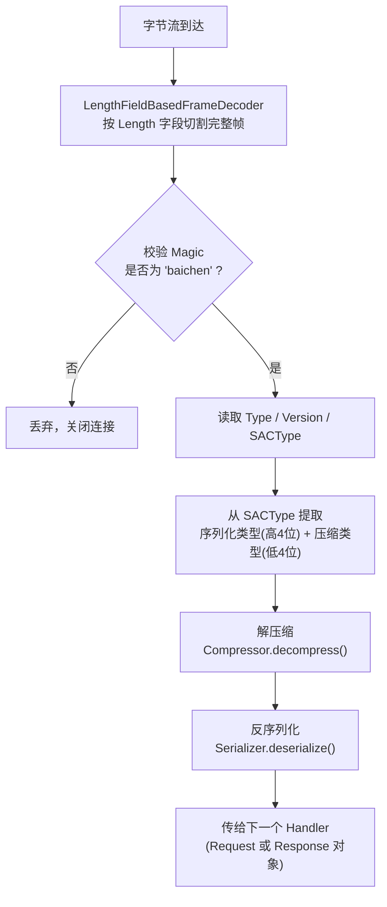
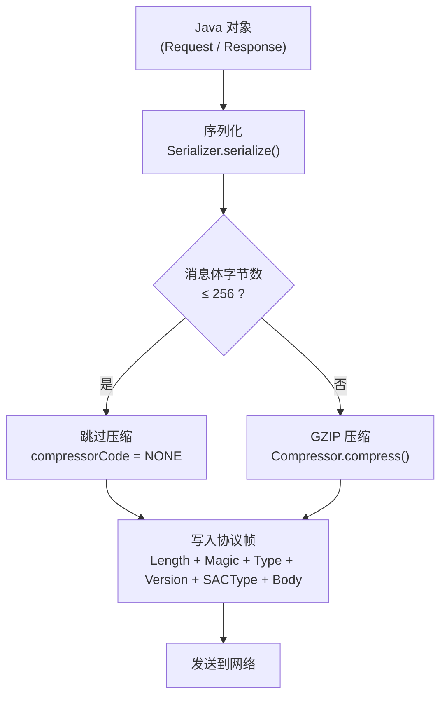
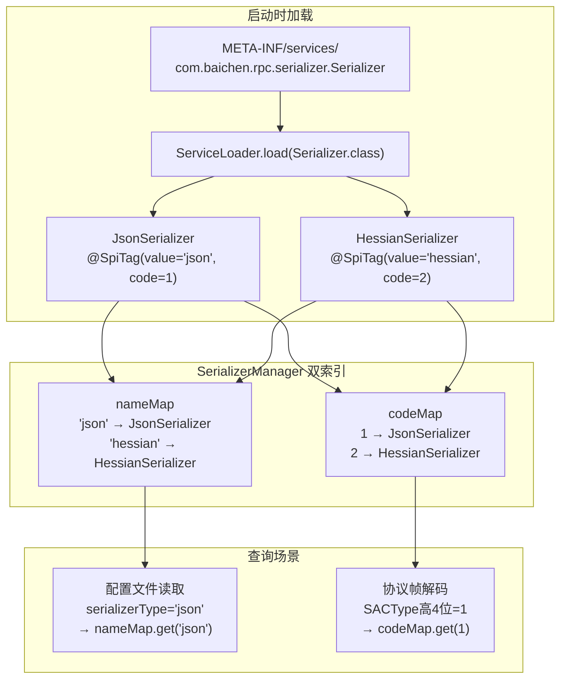

# 第 3 篇：编解码 + SPI — 可插拔设计的正确姿势

> 上一篇讲了数据怎么在网络上传输，以及协议帧的格式。这一篇讲数据在传输前后如何变形：序列化和压缩，以及让这一切可插拔的 SPI 机制。

---

## 序列化是什么

想象你要通过快递寄一件精美的瓷器。你不能直接把裸露的瓷器扔进邮箱——你需要把它**打包**：放进泡沫盒、外面套纸板箱、贴上地址标签，变成一个快递包裹。收件方拿到包裹后，再**拆箱**还原出原来的瓷器。

序列化就是这个打包的过程：

- **序列化**：把内存里的 Java 对象（瓷器）变成字节数组（包裹），才能在网络上传输。
- **反序列化**：收到字节数组（包裹）后，还原成 Java 对象（瓷器）。

没有序列化，两台机器之间根本没办法传递数据——因为对方的 JVM 根本不认识你内存里那块二进制。

---

## JSON vs Hessian：各自的取舍

本框架实现了两种序列化方式，它们代表了两种截然不同的权衡策略。

### JsonSerializer：可读性优先

```java
// JsonSerializer.java
public byte[] serialize(Object obj) {
    // 把对象转成 JSON 字符串，再编码成 UTF-8 字节数组
    return JSONObject.toJSONString(obj).getBytes(StandardCharsets.UTF_8);
}

public <T> T deserialize(byte[] bytes, Class<T> clazz) {
    // 把 UTF-8 字节数组解码成字符串，再解析成对象
    return JSONObject.parseObject(new String(bytes, StandardCharsets.UTF_8), clazz,
        JSONReader.Feature.SupportClassForName);
}

@Override
public int getCode() { return 0; }  // code=0，占协议头中的编号

@Override
public String getName() { return "json"; }  // name="json"，用于配置文件
```

序列化后的字节是可读文本，比如 `{"userId":123,"name":"Alice"}`。人可以直接看懂，调试极其方便。代价是体积偏大——同样的数据，JSON 通常比二进制格式大 2~5 倍。

### HessianSerializer：性能优先

```java
// HessianSerializer.java
public byte[] serialize(Object obj) {
    try (ByteArrayOutputStream baos = new ByteArrayOutputStream()) {
        HessianOutput hessianOutput = new HessianOutput(baos);
        hessianOutput.writeObject(obj);   // 以二进制格式写出
        hessianOutput.flush();
        return baos.toByteArray();
    }
}

@Override
public int getCode() { return 1; }  // code=1
@Override
public String getName() { return "hessian"; }
```

Hessian 是二进制协议，序列化后的字节不可读，但体积小、解析快。在微服务高并发场景下，传输更少的字节意味着更低的延迟和带宽消耗。

### 怎么选？

| 场景 | 推荐 |
|------|------|
| 联调阶段、需要抓包调试 | JSON |
| 生产环境、高并发、对延迟敏感 | Hessian |
| 跨语言调用（如 Python 调 Java） | JSON（通用性更好） |
| 同语言内部服务调用 | Hessian |

---

## SACType：一个字节驱动序列化和压缩的选择

协议头里有一个 `SACType` 字节，负责同时记录**序列化类型**和**压缩类型**。这个设计非常精妙——用位运算把两个维度塞进一个字节里。

```
SACType 字节布局：
+--------+--------+
|  高4位  |  低4位  |
+--------+--------+
|序列化类型|压缩类型 |
+--------+--------+
```

### 编码时：拼装 SACType

```java
// MessageEncoder.java — initIfNecessary 方法
// 序列化器 code=0（json）或 1（hessian），压缩器 code=0（none）或 1（gzip）
defaultSACType = (byte) (defaultSerializer.getCode() << 4 | defaultCompressor.getCode());
//                        ↑ 序列化码左移4位放到高4位   ↑ 压缩码直接放到低4位
```

举个具体例子：
- 使用 Hessian（code=1）+ Gzip（code=1）：`SACType = (1 << 4) | 1 = 0x11 = 0001_0001`
- 使用 JSON（code=0）+ 不压缩（code=0）：`SACType = (0 << 4) | 0 = 0x00 = 0000_0000`

### 解码时：拆解 SACType

```java
// MessageDecoder.java
byte SACType = decode.readByte();
byte serializerCode = (byte) (SACType >>> 4);        // 右移4位，取出高4位
byte compressorCode = (byte) (SACType & 0b00001111); // 与掩码，取出低4位
Serializer serializer = serializerManager.getSerializer(serializerCode);
Compressor compressor = compressorManager.getCompressor(compressorCode);
```



为什么这样设计？**一个字节能表达 16×16 = 256 种组合**，绰绰有余，同时极度节省协议头空间。如果用两个字段分别存，虽然可读性略好，但每个消息都要多传几个字节，在高并发下是实实在在的额外开销。

---

## 为什么小消息不压缩

看 `MessageEncoder` 里有一段容易被忽略的逻辑：

```java
// MessageEncoder.java — encode 方法
byte[] body = defaultSerializer.serialize(msg);
if (body.length <= 256) {
    // 小消息：把 SACType 低4位（压缩码）清零，表示"不压缩"
    serializeTypeCode &= (byte) 0xF0;   // 0xF0 = 1111_0000，保留高4位，清零低4位
} else {
    // 大消息：执行压缩
    body = defaultCompressor.compress(body);
}
```



压缩不是免费的——Gzip 等算法需要消耗 CPU 算力来扫描数据、建立哈希表、寻找重复模式。对于 256 字节以下的小消息，这个 CPU 开销相对于数据量本身来说比例太高，而且压缩后的数据有时甚至比原始数据更大（因为压缩格式本身有元数据开销）。**得不偿失，直接跳过。**

这是一个典型的工程权衡：不追求极致一致性，而是在实际场景下做最优选择。

---

## SPI 机制：可插拔的正确姿势

这是本篇的核心。请仔细读完这一节——理解了 SPI，你就理解了所有优秀框架（Dubbo、JDBC、SLF4J）的扩展点设计哲学。

### 问题引入：如果用 if-else 会怎样

假设没有 SPI，SerializerManager 可能会这样写：

```java
// 反面教材：硬编码 if-else
public Serializer getSerializer(String type) {
    if ("json".equals(type)) {
        return new JsonSerializer();
    } else if ("hessian".equals(type)) {
        return new HessianSerializer();
    } else {
        throw new IllegalArgumentException("Unknown type: " + type);
    }
}
```

这种写法有一个根本性问题：**每次新增序列化方式，都必须修改这段代码**。

今天加了 Protobuf，要改。明天加了 Kryo，要改。框架的使用者想扩展自己的序列化实现，还得去修改框架源码、重新编译框架。这违反了软件设计的**开闭原则**（Open/Closed Principle）：对扩展开放，对修改关闭。

更糟的是，随着时间推移，这个 if-else 链会越来越长，最终变成一座屎山。

### Java SPI 的工作原理

SPI 全称 **Service Provider Interface**，是 JDK 内置的一套服务发现机制。它的规则简单得令人惊讶：

1. 在 `META-INF/services/` 目录下创建一个文件。
2. 文件名 = 接口的全限定类名。
3. 文件内容 = 实现类的全限定类名，每行一个。
4. 运行时用 `ServiceLoader.load(接口.class)` 加载所有实现。

看看项目里实际的文件：

**文件名：** `META-INF/services/com.baichen.rpc.serializer.Serializer`
```
com.baichen.rpc.serializer.HessianSerializer
com.baichen.rpc.serializer.JsonSerializer
```

**文件名：** `META-INF/services/com.baichen.rpc.compressor.Compressor`
```
com.baichen.rpc.compressor.GzipCompressor
com.baichen.rpc.compressor.NoneCompressor
```

这个机制的妙处在于：**核心代码完全不知道有哪些实现，它只负责调用接口**。具体有哪些实现，完全由 `META-INF/services/` 文件决定。想新增一个实现，只需要：① 写一个新类实现接口，② 在 services 文件里加一行——原有代码一行不动。



### @SpiTag + *Manager：项目自定义的 SPI 增强

标准 Java SPI 只能按接口加载所有实现，拿不到单个实现。本项目在标准 SPI 之上做了一层增强，核心是 `@SpiTag` 注解和 `*Manager` 类。

#### Extension 接口

序列化器和压缩器通过实现 `Extension` 接口来提供 name 和 code 两种标识：

```java
// Extension.java
public interface Extension {
    String getName();           // 按名字查找，如 "json"、"hessian"
    default int getCode() { return -1; } // 按编号查找，如 0、1（编解码时使用）
}
```

以 `JsonSerializer` 为例：

```java
// JsonSerializer.java（实现 Extension 接口的方法）
@Override
public String getName() { return "json"; }  // 用于配置文件，人类可读
@Override
public int getCode() { return 0; }          // 用于协议字节，节省空间
```

`@SpiTag` 注解则用在注册中心、负载均衡器、重试策略等组件上，提供按名字查找的能力（如 `@SpiTag("zookeeper")`、`@SpiTag("random")`）。两者都是"给实现类贴标签"，但用途略有侧重：`Extension` 兼顾名字和编号，`@SpiTag` 主要用于名字查找。

#### SerializerManager：用 ServiceLoader 建双索引

```java
// SerializerManager.java
public class SerializerManager {
    // 双索引：按编号查 O(1)，按名字查 O(1)
    private final Map<Byte, Serializer> codeMap = new HashMap<>();
    private final Map<String, Serializer> nameMap = new HashMap<>();

    private void init() {
        // 1. 用标准 Java SPI 加载所有 Serializer 实现
        ServiceLoader<Serializer> loader = ServiceLoader.load(Serializer.class);

        for (Serializer serializer : loader) {
            // 2. 校验 code 合法性（0~15，因为 SACType 高4位只有4bit）
            if (serializer.getCode() < 0 || serializer.getCode() > 15) {
                throw new IllegalArgumentException("Serializer code must be between 0 and 15");
            }
            // 3. 防止重复注册
            if (codeMap.put((byte) serializer.getCode(), serializer) != null) {
                throw new IllegalArgumentException("Duplicate serializer code: " + serializer.getCode());
            }
            // 4. 按名字建索引（统一转大写，避免大小写问题）
            if (nameMap.put(serializer.getName().toUpperCase(Locale.ROOT), serializer) != null) {
                throw new IllegalArgumentException("Duplicate serializer name: " + serializer.getName());
            }
        }
    }

    // 两种查询方式
    public Serializer getSerializer(byte code) { return codeMap.get(code); }   // 解码时用
    public Serializer getSerializer(String name) { return nameMap.get(name); } // 配置时用
}
```

整个初始化过程只在应用启动时执行一次，之后查询都是内存 Map 的 O(1) 操作，几乎零开销。

#### 为什么 code 比 value 更适合编解码？

看 SACType 字节的拆解代码：

```java
byte serializerCode = (byte) (SACType >>> 4);  // 取出高4位，得到一个数字
Serializer serializer = serializerManager.getSerializer(serializerCode); // 按数字查
```

协议帧里只有 1 个字节来存储序列化类型，最多能放一个 0~15 的数字。用字符串 "json" 需要 4 个字节，"hessian" 需要 7 个字节——根本放不下，也没必要。

**数字用于传输（省空间），名字用于配置（易读懂）——各司其职。**

---

## 设计追问

### Q1：为什么用 SPI 而不是 if-else 或 Map 硬编码？

**A：开闭原则。**

用硬编码（if-else 或 static Map）的问题是：每次新增实现，都必须修改已有代码。在开源框架中，这意味着用户必须修改框架源码、重新编译——几乎不可接受。

用 SPI，新增一个序列化实现的完整步骤是：
1. 实现 `Serializer` 接口，加上正确的 `getName()` 和 `getCode()`
2. 在 `META-INF/services/com.baichen.rpc.serializer.Serializer` 里加一行类名
3. **不需要修改任何已有代码**，包括 `SerializerManager`

框架的使用者甚至可以在自己的 JAR 包里提供实现，只要 `META-INF/services/` 文件在 classpath 上，`ServiceLoader` 就能找到它。这就是"**对扩展开放，对修改关闭**"的工程实践。

### Q2：getCode() 和 getName() 分别用在什么场景？

**A：code 用在协议帧里，name 用在配置文件里——两种场景对标识符的要求截然不同。**

`getCode()`（数字）的使用场景：
- 协议帧的 `SACType` 字节，高 4 位只能放 0~15 的数字
- 解码时从字节流取出数字，直接查 `codeMap` 定位实现
- 数字比字符串省空间、比较更快

`getName()`（字符串）的使用场景：
- 配置文件里写 `serializer=json`，人类可读，不容易写错
- 启动时读配置、初始化默认序列化器
- 字符串比数字更有自描述性

两者互补：启动阶段按名字查到具体实现并取出其 code，运行阶段（编解码）全部用 code 操作。一次"名字 → 实现"的查询换来了后续所有请求的"code → 实现"高效查询。

### Q3：SPI 和 Spring 的 @Autowired 有什么区别？

**A：两者都是"依赖注入"的思想，但适用层次和依赖深度不同。**

| 对比维度 | Java SPI | Spring @Autowired |
|---------|----------|-------------------|
| 依赖 | JDK 原生，零依赖 | 必须有 Spring 容器 |
| 发现机制 | `META-INF/services/` 文件 | 注解扫描 + Bean 工厂 |
| 管理范围 | 只管"找到所有实现" | 管生命周期、AOP、事务等 |
| 适用场景 | 框架扩展点、基础设施 | 业务代码的依赖管理 |
| 典型例子 | JDBC Driver、SLF4J 绑定 | Service 注入 Repository |

Spring 的 `@Autowired` 功能更强大，但它要求整个应用运行在 Spring 容器里。RPC 框架是基础设施组件，它本身可能被 Spring 应用使用，也可能被没有 Spring 的应用使用——如果框架内部依赖了 Spring，就把自己的适用范围大幅收窄了。

Java SPI 是 JDK 原生机制，不依赖任何框架，**更适合框架级别的扩展点设计**。Dubbo、Nacos、SLF4J 都是这个思路（Dubbo 还在标准 SPI 基础上做了更强的增强，跟本项目的思路类似）。

---

## 大白话总结

**可插拔设计，就像换电池。**

手机坏了不用扔，换块电池就行。电池换了，手机图纸一个字没改。今天出了一款新型号电池，你直接换上去——没人需要重新画手机图纸。这就是"可插拔"：零件可以替换，整体不用动。

本文讲的框架也是这个思路：想换一种打包方式，只需要做一个新零件、在零件目录里登记一行，其余所有地方原封不动。

**消息打包有两种选择。**

一种打包方式，拆开之后人眼能直接看懂里面写的什么，像明信片。好处是调试方便，坏处是占地方，同样的内容要花更多纸。

另一种打包方式，拆开后看到的是一堆符号，人眼看不懂，但机器能还原——就像密文。好处是体积小、传起来更快，坏处是你没法直接扫一眼知道里面写了什么。

**小包裹不需要真空压缩。**

给一件 T 恤抽真空，确实能让包装小一点。但抽真空本身也要花时间和力气。如果你要寄的东西只有一张纸条，抽真空不但费劲，压完有时反而比原来还大（因为真空袋自身也占地方）。所以本框架规定：小包裹直接寄，不做额外处理；只有大包裹才值得花力气压一压。

**一张车票上同时印了座位号和车厢号。**

快递单上那个短短的数字，可以同时藏两条信息：前半段是车厢号，后半段是座位号。读单子的人把前半段取出来看车厢，把后半段取出来看座位——一个数字，两份内容，一次传递。

本框架用的正是这个思路：传递消息时只用一个小数字，前一半告诉接收方"用哪种打包方式"，后一半告诉接收方"用不用压缩"。紧凑，不浪费。

---

*下一篇：第 4 篇 — 服务发现：Consumer 如何找到 Provider 的地址，以及注册中心挂了怎么办。*
