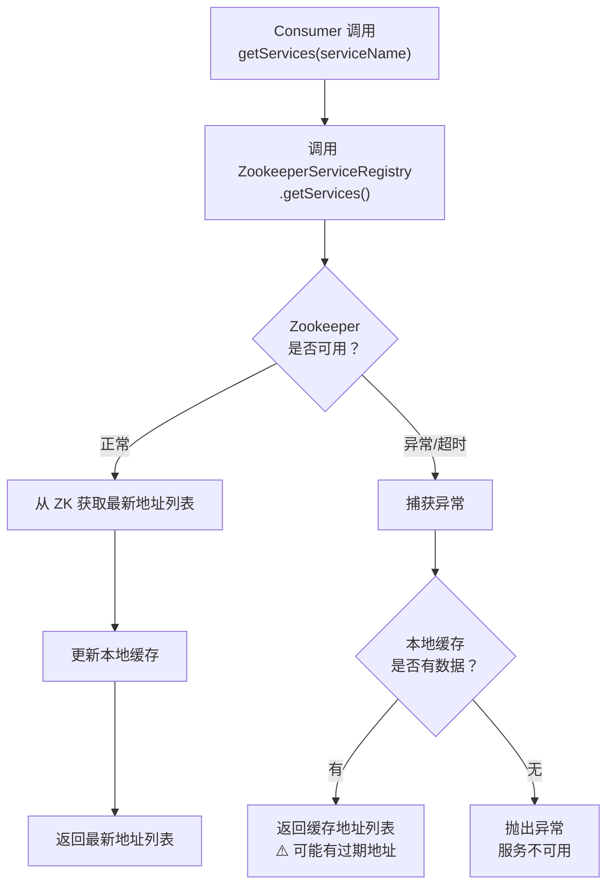
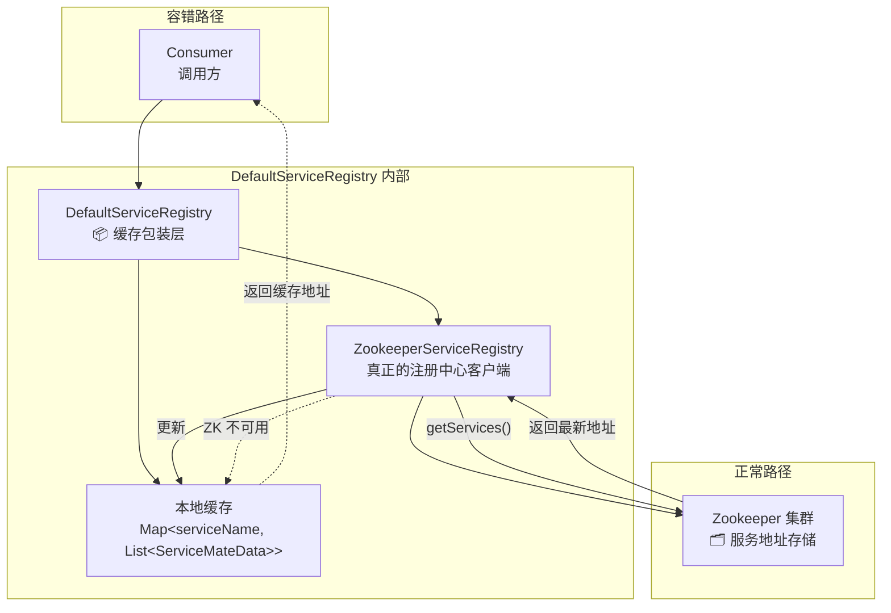

# 第 4 篇：服务发现 — Zookeeper + 缓存容错

> 上一篇讲了数据如何编解码和 SPI 可插拔设计。这一篇讲 Consumer 怎么找到 Provider：服务发现。

---

## 服务发现的本质：动态寻址

想象你手机里存了一个朋友的座机号码。这个号码是固定的，绑定在那根电话线上。但如果朋友搬家了，号码变了，你不知道，就再也打不通了。

微服务之间调用也面临同样的问题。如果把 Provider 的 IP 和端口**硬编码**在 Consumer 的配置文件里，就会遇到：

- Provider 扩容了，新加了三台机器，Consumer 完全不知道
- Provider 某台机器宕机了，Consumer 还在往那台死机上发请求
- Provider 迁移机房，IP 全变了，Consumer 要改配置重新发布

解决方案就是**动态寻址**——不写死地址，而是每次调用前去一个"公共的地址本"查一下。这个机制就叫服务发现。

类比 DNS：你在浏览器输入 `www.example.com`，背后 DNS 服务器帮你查出对应的 IP 地址。服务发现做的事情本质上一样：**服务名 → 地址列表**。

---

## Zookeeper 在这里的角色

Zookeeper（以下简称 ZK）是一个分布式协调服务。在本框架中，它扮演的是**公告栏**的角色，仅此而已，不需要深入理解它的原理。

工作流程非常直观：

1. **Provider 启动时**：在公告栏贴一张纸条——"我叫 `AddService`，地址是 `192.168.1.1:9091`"
2. **Consumer 需要调用时**：来公告栏查——"谁提供 `AddService`？"，拿到地址列表，选一个发请求

`ZookeeperServiceRegistry` 把这两个动作封装成了两个方法：

```java
// Provider 启动时调用，在 ZK 上注册自己
@Override
public void registry(ServiceMateData mateData) throws Exception {
    ServiceInstance<ServiceMateData> serviceInstance = ServiceInstance.<ServiceMateData>builder()
            .address(mateData.getServiceName())
            .port(mateData.getPort())
            .name(mateData.getServiceName())
            .payload(mateData)
            .build();
    serviceDiscovery.registerService(serviceInstance);
}

// Consumer 发起调用时，查询 ZK 上的地址列表
@Override
public List<ServiceMateData> fetchSeviceList(String serviceName) throws Exception {
    return serviceDiscovery.queryForInstances(serviceName)
            .stream()
            .map(ServiceInstance::getPayload)
            .toList();
}
```

初始化时，通过 Curator 客户端连上 ZK，并设置了重试策略（指数退避重试，最多 3 次），所有服务信息都存在 `/rpc` 路径下：

```java
client = CuratorFrameworkFactory.builder()
        .connectString(config.getConnectString())
        .sessionTimeoutMs(60000)
        .connectionTimeoutMs(3000)
        .retryPolicy(new ExponentialBackoffRetry(1000, 3))
        .build();
```

---

## ServiceMateData：服务的名片

每个 Provider 注册时，携带的信息就是一张"名片"——`ServiceMateData`：

```java
@Data
@AllArgsConstructor
@NoArgsConstructor
public class ServiceMateData {

    private String serviceName;  // 服务名，如 "com.baichen.demo.AddService"

    private String host;         // 机器 IP

    private int port;            // 监听端口
}
```

三个字段，简洁而完备：Consumer 拿到这张名片，就知道去哪里、以什么端口连接这个服务。ZK 上存的，也是这张名片的 JSON 序列化结果。

---

## DefaultServiceRegistry：注册中心挂了怎么办

这是本篇的设计亮点，重点讲。

直接调 `ZookeeperServiceRegistry` 有一个致命的问题：**ZK 如果出现故障，所有 RPC 调用立刻全部失败**——Consumer 查不到地址，自然无法发请求。

`DefaultServiceRegistry` 解决了这个问题，核心代码只有十几行，但极为精妙：

```java
@Slf4j
public class DefaultServiceRegistry implements ServiceRegistry {

    private final ServiceRegistry delegate;  // 被装饰的"真正"注册中心

    private Map<String, List<ServiceMateData>> serviceCache = new ConcurrentHashMap<>();

    @Override
    public List<ServiceMateData> fetchSeviceList(String serviceName) {
        try {
            // 正常路径：调 ZK 拿最新地址，顺手更新缓存
            List<ServiceMateData> serviceMateData = delegate.fetchSeviceList(serviceName);
            serviceCache.put(serviceName, serviceMateData);
            return serviceMateData;
        } catch (Exception e) {
            // 降级路径：ZK 挂了，从本地缓存返回上次的地址列表
            return serviceCache.getOrDefault(serviceName, new ArrayList<>());
        }
    }
}
```



逻辑一目了然：

- **ZK 正常**：调 `delegate.fetchSeviceList()` 拿到最新地址，存入 `serviceCache`，返回结果
- **ZK 异常**：catch 住异常，从 `serviceCache` 返回上次缓存的地址列表，框架继续工作

这里用到了**装饰器模式（Decorator Pattern）**：`DefaultServiceRegistry` 包裹了一个 `ServiceRegistry`（`delegate`，实际上是 `ZookeeperServiceRegistry`），在其原有功能之上叠加了缓存能力，但对外暴露的接口完全相同。调用方完全感知不到这一层包装的存在。

整体结构如下：

```
Consumer
   └─ fetchSeviceList("AddService")
         ↓
   DefaultServiceRegistry          ← 装饰器：负责缓存 + 容错
         ↓ (正常) / ↑ (ZK 挂了，走缓存)
   ZookeeperServiceRegistry        ← 真正的 ZK 访问实现
         ↓
   Zookeeper 集群
```



---

### 设计追问

#### Q1：为什么要加缓存层？直接每次都调 Zookeeper 有什么问题？

两个原因，缺一不可：

**① 性能问题**

`fetchSeviceList` 并不是只在系统启动时调用一次，它发生在**每一次 RPC 调用链路上**。如果没有缓存，每次 Consumer 发起一个方法调用，都要先网络访问 ZK、等待响应、拿到地址列表，再去连 Provider。

一个高并发的服务每秒可能有几千次 RPC 调用。每次都去 ZK 查，ZK 会成为整个系统的性能瓶颈：延迟增加、ZK 负载飙高、最终引发连锁反应。缓存把"查地址"的开销摊薄成接近零，是必须的优化。

**② 可用性问题**

ZK 本身也是一个分布式系统，它也会出故障——网络抖动导致连接断开、ZK 集群在做主从切换、运维操作导致短暂不可用……这些情况在生产环境是真实存在的。

没有缓存时，ZK 一旦不可用，Consumer 查不到地址，所有 RPC 调用立刻全部失败，业务中断。有了缓存，ZK 短暂不可用时，Consumer 拿着上次缓存的地址继续发请求，框架在感知不到故障的情况下继续工作，直到 ZK 恢复。

缓存的本质是用"轻微的地址延迟"换取"系统整体的可用性"，这是一个非常划算的交换。

---

#### Q2：缓存会不会拿到过期地址？如果 Provider 下线了，Consumer 还拿着旧地址会怎样？

**会的，这是缓存容错的代价，需要正视。**

场景：ZK 正常运行时，某个 Provider 节点宕机了，ZK 上的服务列表已经摘除了这个节点。但就在 ZK 宕机的那一刻，Consumer 的缓存里还存着旧的地址列表，包含那个已经宕机的 Provider。Consumer 从缓存拿到地址后，向那个宕机节点发请求，自然会失败。

**但这并不是灾难性的结果**，因为框架有配套的容错机制：

1. RPC 调用失败后，框架会触发**重试策略（FailOverPolicy）**，自动换其他节点重试
2. 地址列表通常包含多个 Provider 节点（集群部署），即使一个节点的地址过期了，其他节点的地址大概率还是有效的
3. ZK 恢复后，缓存会在下一次成功的 `fetchSeviceList` 调用时自动刷新

所以真实的行业权衡是：接受"ZK 故障期间，极少数请求因地址过期多重试一次"，来换取"ZK 故障期间，整体服务继续可用"。这比"ZK 一挂就全挂"在生产中要好得多。

这个思维模式在分布式系统设计中非常普遍：**宁可偶尔重试，也要保证系统能继续转**。

---

#### Q3：DefaultServiceRegistry 用了什么设计模式？

**装饰器模式（Decorator Pattern）**。

装饰器模式的核心是：用一个新类包裹原始对象，让新类和原始对象实现同一个接口，新类在调用原始对象方法的前后增加额外逻辑，调用方感知不到这层包装。

在这里：

| 角色 | 对应实现 |
|---|---|
| 公共接口 | `ServiceRegistry` |
| 被装饰的原始对象 | `ZookeeperServiceRegistry` |
| 装饰器 | `DefaultServiceRegistry` |
| 新增的能力 | 缓存 + 降级容错 |

`DefaultServiceRegistry` 持有一个 `ServiceRegistry delegate` 成员变量（即 `ZookeeperServiceRegistry` 实例），所有调用先转发给 `delegate`，成功就更新缓存，失败就从缓存兜底。

这个模式的优点在于**开闭原则**：不改动 `ZookeeperServiceRegistry` 的任何代码，就为它增加了缓存能力。未来如果要加监控埋点、加超时控制，也可以再套一层装饰器，完全不影响已有代码。

对比继承方式：如果用继承来增加缓存（写一个 `CachedZookeeperServiceRegistry extends ZookeeperServiceRegistry`），就把缓存逻辑和 ZK 逻辑绑死了，换成 Redis 注册中心时还得再写一个 `CachedRedisServiceRegistry`，代码重复。装饰器把"缓存"这个能力从具体实现中解耦了出来。

---

## ServiceRegistryManager：SPI 让注册中心可插拔

注册中心的实现不应该写死成 Zookeeper。如果某天要换成 Redis、Nacos 或 Etcd，难道要改框架代码？

`ServiceRegistryManager` 用 Java SPI（Service Provider Interface）机制解决了这个问题：

```java
public class ServiceRegistryManager {

    private final Map<String, ServiceRegistry> registries = new HashMap<>();

    public ServiceRegistryManager() {
        // 通过 Java SPI 加载所有 ServiceRegistry 实现
        ServiceLoader<ServiceRegistry> loader = ServiceLoader.load(ServiceRegistry.class);
        for (ServiceRegistry registry : loader) {
            // 读取实现类上的 @SpiTag 注解，获取名称（如 "zookeeper"）
            SpiTag annotation = registry.getClass().getAnnotation(SpiTag.class);
            if (annotation == null) {
                log.warn("ServiceRegistry {} does not have SpiTag annotation, skipping",
                        registry.getClass().getName());
                continue;
            }
            String name = annotation.value().toLowerCase();
            registries.put(name, registry);
        }
    }

    public ServiceRegistry getServiceRegistry(String type) {
        ServiceRegistry registry = registries.get(type.toLowerCase());
        if (registry == null) {
            throw new IllegalArgumentException("Unsupported registry type: " + type);
        }
        return registry;
    }
}
```

`ZookeeperServiceRegistry` 上标注了 `@SpiTag("zookeeper")`，`ServiceRegistryManager` 启动时扫描所有实现，按 tag 名字建立映射表。

想换成 Redis 注册中心？只需要：
1. 新建一个 `RedisServiceRegistry implements ServiceRegistry`
2. 标上 `@SpiTag("redis")`
3. 在 `META-INF/services/` 里注册一行
4. 配置文件里把 `registryType` 改成 `"redis"`

框架代码零改动。这正是上一篇讲的 SPI 可插拔设计在注册中心层的应用。

---

## 大白话总结

想象你出门吃饭，要找一家火锅店。

以前的做法：把店名和地址写在纸条上，每次照纸条去找。问题是，这家店可能搬了、倒闭了、或者开分店了，你手里的纸条永远是旧的。

新的做法：打开美团，搜"火锅"，平台帮你列出附近所有在营业的门店。门店开业时主动在美团上登记自己的位置，你来查的时候就能拿到最新的名单。

这就是动态查找地址干的事：服务提供方开业时主动登记，服务调用方来平台查名单，而不是自己手里存一张死的地址纸条。

---

现在，这个平台（美团服务器）自己也可能偶尔宕机。如果平台崩了，难道你就完全找不到吃饭的地方了吗？

不一定——你手机里还有"收藏夹"，里面存着你上次查到的那几家店。平台挂了，打开收藏夹，大概率那几家店还在原来的地方开着，你仍然能去吃饭。

这就是本地收藏兜底：正常情况下，每次查完名单都悄悄存一份在本地；平台挂了，就用本地存的那份继续工作。代价是，万一某家店上周刚搬走，你去了扑个空，打个电话换一家就行了——总比完全找不到吃饭的地方强。

---

至于美团为什么能支持饿了么的门店、京东到家的门店……那是框架里另一套"插件机制"在保证的，只要门店在任意平台登记过，你都能查得到，不管背后用的是哪家平台的系统。

---

*下一篇：第 5 篇 — 连接管理：找到地址之后，连接如何建立、复用，以及一个请求从发出到收到响应的完整生命周期。*
