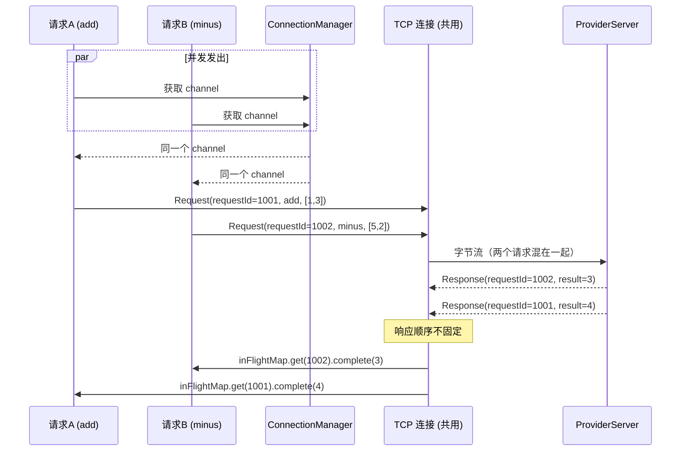
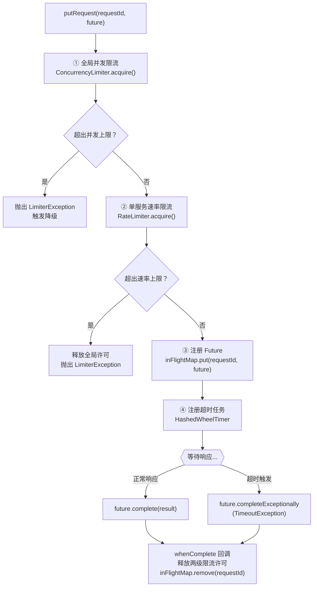

# 第 5 篇：连接管理 — 连接池 + 请求生命周期

> 上一篇讲了 Consumer 如何找到 Provider 的地址。这一篇讲找到地址之后，连接如何建立、复用，以及一个请求从发出到收到响应的完整生命周期。

---

## 为什么需要连接池

拿到 Provider 的 IP 和端口之后，Consumer 需要建立一条 TCP 连接，才能开始传输数据。

问题是，建立 TCP 连接并不便宜。你一定听说过"TCP 三次握手"——简单说，建连要在客户端和服务端之间来回发三次数据包，双方互相确认"我能听到你、你也能听到我"，才算连通。在局域网内这个过程只需要几毫秒，但它是实实在在的延迟，而且是**每次新建连接都要付的代价**。

类比一下：想象你每次给朋友打电话，都要先说"你好，我是张三，你好，我是李四，好的张三我听到你了，好的李四我也听到你了……"，寒暄完了才能说正事。如果每次打电话都这样，效率极低。

更合理的做法是：建好一条"热线"，下次有事直接拿起来说正事。这条热线就是**连接池**的本质——提前建好连接、保持连接、下次需要时直接取用，省去每次重新握手的开销。

对于高并发的 RPC 框架，如果每次方法调用都新建一条 TCP 连接，光是连接建立的延迟就会把性能打垮。连接池让多个请求复用同一条连接，这是 RPC 框架性能的基础。

---

## ConnectionManager：连接的创建与复用

`ConnectionManager` 就是这条热线的管理者。它内部维护了一张表：

```java
private final Map<String, ChannelWrapper> channelMap = new ConcurrentHashMap<>();
```

键是 `"IP:端口"` 字符串，值是对这条连接（Netty 里叫 `Channel`）的包装。

核心方法是 `getChannel()`，逻辑非常直接：

```java
public Channel getChannel(ServiceMateData service) {
    String host = service.getHost();
    int port = service.getPort();
    String key = host + ":" + port;

    channelMap.computeIfAbsent(key, k -> {
        try {
            ChannelFuture channelFuture = bootstrap.connect(host, port).sync();
            Channel channel = channelFuture.channel();
            channel.closeFuture().addListener(f -> {
                // 连接关闭时，从 channelMap 中移除对应的 ChannelWrapper
                channelMap.remove(key);
                inFlightRequestManager.clearChannel(service);
            });
            return new ChannelWrapper(channel);
        } catch (InterruptedException e) {
            return new ChannelWrapper(null);
        }
    });

    Channel channel = channelMap.get(key).getChannel();
    // 如果连接不可用，就从 channelMap 中移除，并返回 null
    if (channel == null || !channel.isActive()) {
        channelMap.remove(key);
        return null;
    }
    return channel;
}
```

流程分三步：

**第一步：查表**
用 `computeIfAbsent` 查 `channelMap`。如果这个 `IP:端口` 对应的连接已经存在，直接跳过，什么都不做。

**第二步：不存在则新建**
如果不存在（`computeIfAbsent` 的 lambda 被触发），就通过 Netty 的 `bootstrap.connect()` 建立一条新连接，拿到 `Channel` 后包进 `ChannelWrapper` 存入表中。

同时，新建连接时注册了一个"连接关闭监听器"（`closeFuture().addListener`）——当这条连接断掉时（无论是对方主动断、网络断、还是本端关闭），自动把它从 `channelMap` 里移除，并通知 `InFlightRequestManager` 做清理。这样下次调用 `getChannel()` 时，发现表里没有，就会重新建连，不会拿着一条死连接一直用。

**第三步：健康检查**
从表里取出 `Channel` 后，还要检查 `channel.isActive()`——即使表里有记录，也可能因为网络问题连接已经断了但监听器还没来得及触发。如果不活跃，立刻从表里踢掉，返回 `null`，让上层知道连接失效，触发重连或重试。

---

## requestId：多路复用的关键

现在我们有了一条复用的 TCP 连接。但立刻面临一个新问题：

假设 Consumer 同时发出了三个请求（比如三个线程各自发了一个 RPC 调用），三个请求都走同一条连接发出去了。过一会儿，服务端陆续返回三个响应，也通过同一条连接传回来。Consumer 怎么知道哪个响应对应哪个请求？

这就是**多路复用（multiplexing）**的核心问题。解法也非常自然：**给每个请求贴一个唯一的单号**。

- 发送时：Consumer 为每个请求生成一个唯一的 `requestId`（整数），把 `requestId` 写入请求消息头，随请求一起发出去
- Provider 收到请求后，把这个 `requestId` 原封不动地写入响应消息头，随响应返回
- Consumer 收到响应时：从响应头取出 `requestId`，就能找到这个请求对应的"等待槽"，把结果填进去

类比快递单号：你同时寄了三个包裹，快递公司给每个包裹贴了不同的单号。快递到了之后，你凭单号认领，不会把给张三的包错误地交给李四。单号就是 `requestId`，快递公司的分拣系统就是下面要讲的 `InFlightRequestManager`。



---

## InFlightRequestManager：请求生命周期全解析

这是本篇最核心的部分。`InFlightRequestManager` 负责管理每一个"正在飞行中（in-flight）"的请求，从发出到收到响应（或超时），整个生命周期都在它的控制下。

它内部维护了以下关键成员：

```java
// 正在等待响应的请求：requestId → CompletableFuture
private final Map<Integer, CompletableFuture<Response>> inFlightRequestMap;

// 超时定时器
private final HashedWheelTimer hashedWheelTimer;

// 全局并发限流器
private final Limiter globalLimiter;

// 每个服务独立的速率限流器
private final Map<ServiceMateData, Limiter> serviceLimiterMap;
```

核心方法是 `putRequest()`，每次发起一个 RPC 请求都会调用它。下面逐步拆解它的五个步骤。



---

### 步骤 1：全局并发限流

```java
if (!globalLimiter.tryAcquire()) {
    future.completeExceptionally(new LimiterException("全局并发限流 (当前限制: " + properties.getGlobalLimit() + ")"));
    return future;
}
```

`globalLimiter` 是一个 `ConcurrencyLimiter`，它内部维护一个计数器，记录当前"正在飞行中"的请求总数。每次调用 `tryAcquire()` 时，如果当前并发数已达上限，直接拒绝这个请求，抛出 `LimiterException`。

**为什么需要全局并发限流？**

如果不加限制，Consumer 可能同时发出成千上万个请求，每个请求都占着一个 `CompletableFuture`，都挂着一个超时定时器。当 Provider 变慢时，"飞行中"的请求越积越多，Consumer 端内存和线程资源被耗尽，Consumer 自己先垮掉了。全局并发限流是 Consumer 的自我保护机制。

---

### 步骤 2：单服务速率限流

```java
Limiter limiter = serviceLimiterMap.computeIfAbsent(service, k -> new RateLimiter(properties.getServiceLimit()));
if (!limiter.tryAcquire()) {
    globalLimiter.release();  // 注意：要先释放步骤 1 拿到的许可
    future.completeExceptionally(new LimiterException("服务速率限流 (当前限制: " + properties.getServiceLimit() + " req/s)"));
    return future;
}
```

除了全局并发限制，每个目标服务还有独立的速率限流器（`RateLimiter`），控制每秒最多向这个服务发多少请求。这防止某一个服务被 Consumer 打爆。

注意这里有一个关键细节：速率限流失败时，**必须先调用 `globalLimiter.release()` 释放步骤 1 的许可**，再返回失败。如果不释放，步骤 1 拿走的并发名额就永远回不来了——就好像借了图书馆一个借阅名额但这本书又没借走，名额白白占着，后来的人就少了一个可以借书的名额。

---

### 步骤 3：注册 Future

```java
inFlightRequestMap.putIfAbsent(request.getRequestId(), future);
```

这一行是多路复用的核心：把 `requestId` 和这个 `CompletableFuture` 的对应关系记入 `inFlightRequestMap`。

此后，当 Consumer 收到响应时，`ConsumerChannelHandler` 会调用：

```java
inFlightRequestManager.completeRequest(resp.getRequestId(), resp);
```

`completeRequest` 内部就是：从 `inFlightRequestMap` 按 `requestId` 取出 `future`，调用 `future.complete(response)` 把结果填进去。等待这个 `future` 的调用方线程就被唤醒，拿到响应结果，继续执行。

---

### 步骤 4：注册超时任务

```java
Timeout timeout = hashedWheelTimer.newTimeout((e) -> {
    if (inFlightRequestMap.remove(request.getRequestId()) != null) {
        future.completeExceptionally(new RpcException("RPC 调用超时，requestId: " + request.getRequestId()));
    }
}, waitResponseTimeoutMs, TimeUnit.MILLISECONDS);
```

每个请求都挂一个定时器：如果在 `waitResponseTimeoutMs` 毫秒内还没有收到响应，定时器触发，把 `future` 标记为超时异常，`future.completeExceptionally(...)` 会触发步骤 5 里注册的 `whenComplete` 回调来释放资源。

注意 `inFlightRequestMap.remove(...)` 先做移除、检查返回值是否为 `null`，这是为了防止竞争：如果响应恰好在超时触发的同一时刻到达，两个操作谁先执行都可能发生，用 `remove` 的返回值来判断"我是否抢到了这次完成权"，确保 `future` 只被完成一次。

---

### 步骤 5：注册完成回调（资源释放的统一出口）

```java
future.whenComplete((r, t) -> {
    // 1. 从 map 中移除（幂等，超时场景下已被移除）
    inFlightRequestMap.remove(request.getRequestId());

    // 2. 取消超时定时器（如果还没触发）
    timeout.cancel();

    // 3. 释放全局并发限流许可
    globalLimiter.release();

    // 4. 释放服务速率限流许可
    limiter.release();
});
```

`whenComplete` 是 `CompletableFuture` 的完成钩子——无论 `future` 以何种方式完成（正常响应、超时异常、连接断开异常），这个回调一定会执行。这是**唯一的资源释放出口**。

两条完成路径：
- **正常响应路径**：收到响应 → `completeRequest()` → `future.complete(response)` → 触发 `whenComplete` → 释放资源
- **超时路径**：定时器触发 → `future.completeExceptionally(TimeoutException)` → 触发 `whenComplete` → 释放资源

无论哪条路径，资源都能释放。

---

### 设计追问

#### Q1：为什么用 HashedWheelTimer 而不是 ScheduledExecutorService？

`ScheduledExecutorService` 是 JDK 标准库提供的定时任务工具，底层用**优先队列（最小堆）**来维护任务的执行顺序。每次添加一个新的定时任务，都要对堆做一次插入操作，时间复杂度是 **O(log n)**——当有 1000 个并发请求，就有 1000 个超时任务，插入和取消任务的开销会随规模上涨。

`HashedWheelTimer` 的原理是一个**时间轮**：想象一个表盘，分成若干格（本框架配置了 64 格，每格代表 1 秒），每个定时任务挂在它到期时间对应的格子里。每隔一个间隔，指针转到下一格，执行那一格里所有到期的任务。添加和取消任务本质上是对一个链表做插入/删除，时间复杂度是 **O(1)**，不受并发请求总数影响。

当有大量并发请求（每个都挂一个超时任务）时，HashedWheelTimer 的性能优势非常明显。此外，Netty 本身就内置了 `HashedWheelTimer`，在 Netty 项目里直接使用，依赖引入零成本，也更加自然。

---

#### Q2：超时时资源释放的顺序为什么关键？（CRITICAL bug 回顾）

这是框架迭代过程中踩过的一个真实的 bug，值得深入讲清楚。

**v0.11 之前的 bug 描述**

早期版本的超时处理代码大致是这样的：

```java
// 超时回调（旧版本）
hashedWheelTimer.newTimeout((e) -> {
    inFlightRequestMap.remove(request.getRequestId());
    future.completeExceptionally(new RpcException("RPC 调用超时"));
    // 这里调用了 completeExceptionally，然后期望 whenComplete 去释放资源
}, waitResponseTimeoutMs, TimeUnit.MILLISECONDS);

// whenComplete 回调（旧版本，存在 bug）
future.whenComplete((r, t) -> {
    if (t == null) {
        // 正常完成时，释放资源
        globalLimiter.release();
        limiter.release();
    }
    // 如果 t != null（超时或其他异常），没有走到 release！
});
```

问题出在 `whenComplete` 里的那个 `if (t == null)` 条件判断。开发者的本意是"正常响应才释放"，但没有意识到：**超时也是一种完成方式**，超时时 `t` 不是 `null`，直接跳过了资源释放。

**后果：限流许可永远回不来**

每发出一个最终超时的请求，`globalLimiter` 就少一个并发许可，且再也无法归还。随着时间推移，许可被一点点"吃掉"，新请求全部因为"全局并发限流"被拒绝。整个 Consumer 越来越慢，最终完全卡死——即使 Provider 完全健康，Consumer 也无法发出任何新请求。

用"图书馆借阅名额"来理解：全局并发许可就像图书馆的借阅名额，总共只有 100 个。每次发出请求，借走一个名额；请求完成，归还一个名额。如果某本书借出去了，但还书的时候借书条（超时分支）不走归还流程，那个名额就永远消失了。借出去的书越来越多，剩余名额越来越少，直到没有人能再借书——图书馆名义上还开着，但没有任何人能借到书。

**修复方案**

修复非常简单：`whenComplete` 里无条件释放资源，不管是正常完成还是异常完成：

```java
future.whenComplete((r, t) -> {
    // 无论成功、超时、还是其他异常，一律释放
    inFlightRequestMap.remove(request.getRequestId());
    timeout.cancel();
    globalLimiter.release();  // 无条件！
    limiter.release();        // 无条件！
});
```

现在 `whenComplete` 成了**唯一的资源释放出口**，无论请求如何收场，资源必然释放，许可必然归还。

这个 bug 的教训是：凡是"借出去"的资源（锁、许可、名额、文件描述符），**释放逻辑必须覆盖所有完成路径**，包括异常路径。只处理正常路径的资源释放，在高并发场景下是定时炸弹。

---

## 大白话总结

想象一家快递公司，在你家和仓库之间运包裹。

---

**关于固定通道**

以前，每次要寄一个包裹，公司都要先修一条新路：推土机来了，铺路、铺轨道、搭桥……才能开始运货。运完就把路拆掉。下次再寄，再重新修一遍。效率极低。

聪明的做法是：修好一条固定的运货通道，保持通道畅通。下次你要寄包裹，通道现成的，直接装车出发。这就是为什么快递公司在固定线路上保持固定的运输通道。

---

**关于单号**

同一条通道上同时运着几百个包裹。包裹到了目的地，收件人怎么认领？凭快递单号。每个包裹在寄出时贴一个唯一的单号，收到时凭单号认领，绝不会拿错。

框架里的每个请求也有一个唯一的编号，响应回来时，凭编号找到那个请求对应的"等待窗口"，把结果塞进去。

---

**关于容量管理和超时**

快递公司的运输通道不是无限大的。如果一下子涌来太多包裹，通道堵死，所有包裹都动不了。所以公司设了两道规矩：

- 全仓库同时最多装 X 个包裹（全局并发限制）
- 每个目的地每小时最多发 Y 个包裹（单服务速率限制）

超过了就暂时拒收，让发件人稍后再来，而不是让通道彻底堵死。

---

**关于超时退款**

如果一个包裹寄出去了，超过了规定时间还没送到，快递公司会通知你"这票货超时了，我们认定丢失"，并且**退还你的运费额度**——这样你下次还能继续寄包裹。

关键词是"退还额度"。如果超时了只通知你，不退额度，时间久了，你所有的额度都被超时的包裹占着，新包裹再也寄不出去，系统就彻底卡死了。这正是 v0.11 之前那个 bug 的根本问题：通知了超时，但忘记退还额度。修复之后，无论包裹是正常签收、超时、还是途中损坏，额度一律归还，系统才能一直正常运转下去。

---

*下一篇：第 6 篇 — 负载均衡 + 重试：有多个 Provider 时如何选路，选错了或失败了如何自救。*
