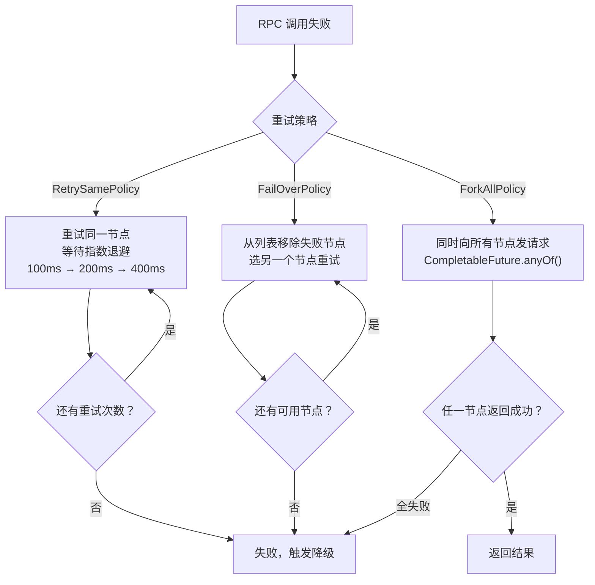
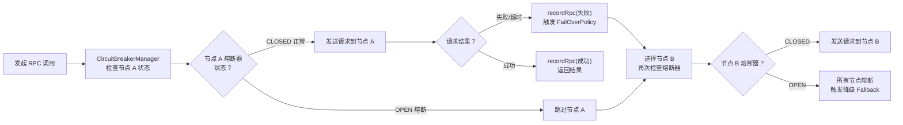

# 第 6 篇：负载均衡 + 重试 — 故障时怎么自救

> 上一篇讲了请求的生命周期管理（连接池 + 超时控制）。这一篇讲当有多个 Provider 时如何选择，以及选错了或失败了如何自救。

---

## 负载均衡：Random vs RoundRobin

生产环境中，同一个服务往往有多个节点在跑。Consumer 发起调用时，框架需要从这些节点里**选一个**发送请求。这就是负载均衡要解决的问题。

框架里实现了两种策略，都实现了同一个接口：

```java
public interface LoaderBalancer {
    ServiceMateData select(List<ServiceMateData> services);
}
```

接口极简——给你一个服务节点列表，你从里面挑一个返回。

### Random：随机选

```java
@SpiTag("random")
public class RandomLoaderBalancer implements LoaderBalancer {
    private final Random random = new Random();

    @Override
    public ServiceMateData select(List<ServiceMateData> services) {
        return services.get(random.nextInt(0, services.size()));
    }
}
```

实现只有一行核心逻辑：`random.nextInt(0, services.size())`，随机生成一个下标，取出对应节点。

**这个实现是无状态的**——每次调用之间没有任何记忆，完全独立。对象里只存了一个 `Random` 实例，仅用于产生随机数，不保存任何调用历史。

适合场景：各节点性能相近、资源配置均等的场景。长期来看，随机算法的分布会趋于均匀。

### RoundRobin：轮流选

```java
@SpiTag("roundRobin")
public class RoundRobinLoaderBalancer implements LoaderBalancer {
    private final AtomicInteger count = new AtomicInteger(0);

    @Override
    public ServiceMateData select(List<ServiceMateData> services) {
        return services.get(Math.abs(count.getAndIncrement() % services.size()));
    }
}
```

核心差异在于 `AtomicInteger count`——这是一个**有状态**的计数器。每次调用 `select`，计数器自增 1，然后对节点数量取余，保证严格轮流。

`AtomicInteger` 的作用：多个线程同时调用 `select` 时，`getAndIncrement()` 是原子操作，不会出现两个线程拿到相同下标的情况。

`Math.abs()` 的作用：计数器一直自增，最终会溢出变成负数，取绝对值保证下标不越界。

**适合场景**：需要精确均匀分配、节点性能相近的场景。比如 3 个节点，前 30 个请求会严格各分 10 个。

### 追问：有没有 RoundRobin 比 Random 更差的情况？

**有。** 当各节点性能差异很大时，RoundRobin 反而是劣势。

举个例子：3 个节点，A 处理速度是 B 和 C 的 10 倍。RoundRobin 会把请求**严格等量**地分给三个节点，意味着 B 和 C 各自承担了 1/3 的流量，但它们处理得很慢，队列积压，整体吞吐上不去。

Random 呢？长期来看也是均匀的，所以同样有这个问题。

真正解决这种场景的是**加权轮询**或**最小连接数**策略——根据节点的实际处理能力动态分配，当前框架尚未实现，但通过 SPI 机制很容易扩展（后面会讲）。

---

## 重试：三种策略的适用场景

节点选好了，发出去的请求还是可能失败。失败后怎么办？框架设计了三种截然不同的应对策略。



所有策略都接收一个 `RetryContext`，里面包含了重试所需的全部上下文：

```java
@Data
public class RetryContext {
    private ServiceMateData failedService;       // 刚才失败的节点
    private List<ServiceMateData> retryList;     // 全部可用节点列表
    private Long waitResponseTimeoutMillis;      // 单次等待超时
    private Long totalTimeoutMs;                 // 总超时预算
    private LoaderBalancer loaderBalancer;       // 负载均衡器

    // 真正发请求的函数：给它一个节点，它返回一个 Future
    private Function<ServiceMateData, CompletableFuture<Response>> retryFunction;
}
```

### RetrySamePolicy：瞬时抖动就重试同一个

**核心思路**：还是打同一个节点，但等一等再打，给节点喘息时间。

```java
@SpiTag("retrySame")
public class RetrySamePolicy implements RetryPolicy {
    private final Random random = new Random();

    @Override
    public Response retry(RetryContext context) {
        int retryCount = 0;
        long endTime = System.currentTimeMillis() + context.getTotalTimeoutMs();

        while (true) {
            try {
                long waitTimeMs = getWaitTimeMs(retryCount);
                if (waitTimeMs >= 1000) {
                    waitTimeMs = 1000;  // 最多等 1 秒
                }
                Thread.sleep(waitTimeMs);

                long lastTimeoutMs = endTime - System.currentTimeMillis();
                if (lastTimeoutMs < 0) {
                    throw new TimeoutException("Total retry timeout exceeded");
                }
                // 仍然发给同一个节点
                return context.getRetryFunction()
                        .apply(context.getFailedService())
                        .get(Math.min(context.getWaitResponseTimeoutMillis(), lastTimeoutMs),
                             TimeUnit.MILLISECONDS);
            } catch (Exception e) {
                retryCount++;
                if (retryCount >= 3) {
                    throw new RuntimeException("Retry failed after 3 attempts", e);
                }
            }
        }
    }

    private long getWaitTimeMs(int retryCount) {
        // 指数退避：50ms, 100ms, 200ms 附近（加随机抖动）
        return (long) (100 * Math.pow(2, retryCount - 1)) + (long) (random.nextLong(0, 50));
    }
}
```

**指数退避**是这里最值得关注的细节。`getWaitTimeMs` 的计算结果随 `retryCount` 增长：

| 第几次重试 | retryCount | 等待时间（约） |
|:---:|:---:|:---:|
| 第 1 次 | 0 | 50ms（100 * 2^-1 ≈ 50，加抖动） |
| 第 2 次 | 1 | 100ms + 抖动 |
| 第 3 次 | 2 | 200ms + 抖动 |

等待时间上限设为 1000ms，防止无限退避。随机抖动（`random.nextLong(0, 50)`）是为了避免多个 Consumer 同时重试时"踩踏"——如果大家都在同一时刻重试，节点压力会瞬间翻倍。

**最多重试 3 次**（`retryCount >= 3`），同时受总超时预算约束（`endTime`），两个条件都会触发放弃。

**适合场景**：网络瞬时抖动（GC 暂停、短暂的网络拥塞）。节点本身没问题，只是那一刻响应慢，稍等一下就好。

### FailOverPolicy：节点故障就换一个

**核心思路**：这个节点可能真的有问题，换一个健康的节点试试。

```java
@SpiTag("failOver")
public class FailOverPolicy implements RetryPolicy {
    @Override
    public Response retry(RetryContext context) throws Exception {
        List<ServiceMateData> retryList = new ArrayList<>(context.getRetryList());
        retryList.remove(context.getFailedService());  // 把故障节点从列表里踢掉
        if (retryList.isEmpty()) {
            throw new RpcException("No more service to retry");
        }

        LoaderBalancer loaderBalancer = context.getLoaderBalancer();
        ServiceMateData retryService = loaderBalancer.select(retryList);  // 从剩余节点中选一个
        return context.getRetryFunction().apply(retryService)
                .get(Math.max(context.getWaitResponseTimeoutMillis(), context.getTotalTimeoutMs()),
                     TimeUnit.MILLISECONDS);
    }
}
```

逻辑分三步走：

1. 复制一份节点列表（`new ArrayList<>(context.getRetryList())`），避免修改原始列表
2. 从副本中移除刚才失败的节点（`retryList.remove(context.getFailedService())`）
3. 用负载均衡器从剩余节点中选一个，发请求

注意这里用 `Math.max` 取超时时间——用剩余预算和单次超时里**较大**的那个，保证在还有时间的情况下充分等待响应。

**适合场景**：某个 Provider 节点真的挂了（进程崩溃、机器宕机）。换一个还活着的节点即可。

**局限**：只重试一次。如果第二个节点也失败了，当前实现不会继续换第三个节点。如需多次 FailOver，需要在外层循环里多次调用。

### ForkAllPolicy：延迟敏感就全部打

**核心思路**：不知道哪个节点最快，干脆同时向所有节点发请求，谁先回来算谁的。

```java
@SpiTag("forkAll")
public class ForkAllPolicy implements RetryPolicy {
    @Override
    public Response retry(RetryContext context) {
        List<ServiceMateData> retryList = new ArrayList<>(context.getRetryList());
        retryList.remove(context.getFailedService());  // 排除已知故障节点
        if (retryList.isEmpty()) {
            throw new RpcException("No more service to retry");
        }

        // 同时向所有剩余节点发请求，每个请求都是一个 CompletableFuture
        CompletableFuture[] futures = new CompletableFuture[retryList.size()];
        for (int i = 0; i < retryList.size(); i++) {
            futures[i] = context.getRetryFunction().apply(retryList.get(i));
        }

        // anyOf：任意一个 Future 完成，就立刻返回它的结果
        CompletableFuture<Object> finishedFuture = CompletableFuture.anyOf(futures);
        try {
            return (Response) finishedFuture.get(
                Math.min(context.getWaitResponseTimeoutMillis(), context.getTotalTimeoutMs()),
                TimeUnit.MILLISECONDS);
        } catch (Exception e) {
            throw new RuntimeException("Retry failed for all services", e);
        }
    }
}
```

**`CompletableFuture.anyOf` 是理解这段代码的钥匙。**

`retryFunction.apply(node)` 返回的是一个 `CompletableFuture<Response>`——它代表"向这个节点发请求"这件事本身，是非阻塞的。调用之后请求立即发出，函数立刻返回，不等待结果。

`for` 循环把 N 个节点的请求**同时**打出去，得到 N 个 Future。

`CompletableFuture.anyOf(futures)` 返回一个新的 Future，它的语义是：**"这 N 个 Future 里，哪个先完成，就用哪个的结果"**。

最后 `.get(timeout, MILLISECONDS)` 阻塞等待，直到第一个响应回来或超时。

可以这样类比：你同时叫了 3 辆出租车，第一个到的你就上车，另外两辆你让它们回去（虽然代码里并没有真正取消其他请求，它们会继续跑完，只是结果被丢弃了）。

这里超时用 `Math.min` 取**较小值**——在已经消耗了部分时间预算的情况下，宁可用更紧的超时，尽快得到结果或快速失败。

**适合场景**：对延迟极度敏感的查询类操作，愿意用多倍的服务端资源换取最低的尾延迟（P99）。

---

## 设计追问

### Q1：ForkAll 有什么代价？什么时候不该用？

**代价：N 倍的服务端压力。**

有 3 个节点就要处理 3 份相同的请求，服务端的 CPU、内存、数据库查询都会乘以 3。如果每个请求都走 ForkAll，服务端的总负载会急剧上升。

**不该用的场景：**

1. **写操作**（新增、修改、删除）：3 个节点都处理了这个请求，数据库会写入 3 次，造成数据重复或不一致。ForkAll 只能用于**幂等的读操作**。

2. **服务端本身已经很忙**：节点快撑不住了，ForkAll 直接把压力乘以 N，是雪上加霜，可能触发雪崩。

3. **成本敏感的场景**：如果服务端调用是收费的（比如第三方 API），ForkAll 意味着成本乘以 N。

**适合的场景**：纯读查询、服务端压力很小、对延迟极度敏感、节点数量少（2~3 个）的情况。

---

### Q2：重试会不会加剧雪崩？和熔断器如何配合？

**会的，重试是双刃剑。**

考虑这个场景：某个节点响应变慢（CPU 过高），请求开始超时。如果所有 Consumer 都触发了 `RetrySamePolicy`，这些超时的请求还会被重新打给同一个节点——节点更忙，更多请求超时，更多重试……这就是**重试风暴**，会加速节点崩溃，甚至蔓延到其他节点。

`FailOverPolicy` 好一点，它把故障节点排除了，重试打到了其他节点。但如果"其他节点"其实也在承压，换过去依然可能雪崩。

**熔断器是配套保障。**

熔断器的职责是监控每个节点的健康状态——当某个节点的失败率或慢响应比例超过阈值，熔断器会进入"断开"状态，直接拒绝发往该节点的请求（不等连接，不等超时，立刻返回错误）。

两者配合的流程是这样的：

```
发起请求
  → 熔断器检查：这个节点还健康吗？
      → 已熔断：直接跳过，相当于主动"踢出列表"
      → 健康：发请求
          → 请求失败
              → FailOverPolicy：从列表里选其他节点
              → 其他节点经过熔断器检查……
```

**重试提供"换节点"能力，熔断器提供"快速失败"保障。**

重试让框架有机会找到可用节点；熔断器确保重试不会打到已经过载的节点上。两者缺一不可：只有重试没有熔断，会出现重试风暴；只有熔断没有重试，偶发的瞬时错误会直接暴露给调用方。



---

## SPI 扩展：LoaderBalancerManager + RetryPolicyManager

两个 Manager 的结构如出一辙，都基于 Java 原生的 SPI 机制（`ServiceLoader`）：

```java
// LoaderBalancerManager（负载均衡）
public class LoaderBalancerManager {
    private final Map<String, LoaderBalancer> balancers = new HashMap<>();

    public LoaderBalancerManager() {
        ServiceLoader<LoaderBalancer> loader = ServiceLoader.load(LoaderBalancer.class);
        for (LoaderBalancer balancer : loader) {
            SpiTag annotation = balancer.getClass().getAnnotation(SpiTag.class);
            String name = annotation.value().toLowerCase();
            balancers.put(name, balancer);
        }
    }

    public LoaderBalancer getLoaderBalancer(String name) {
        return balancers.get(name.toLowerCase());
    }
}
```

```java
// RetryPolicyManager（重试策略）
public class RetryPolicyManager {
    private final Map<String, RetryPolicy> retryPolicies = new HashMap<>();

    public RetryPolicyManager() {
        ServiceLoader<RetryPolicy> loader = ServiceLoader.load(RetryPolicy.class);
        for (RetryPolicy policy : loader) {
            SpiTag annotation = policy.getClass().getAnnotation(SpiTag.class);
            String name = annotation.value().toUpperCase();
            retryPolicies.put(name, policy);
        }
    }

    public RetryPolicy getRetryPolicy(String name) {
        return retryPolicies.get(name.toUpperCase());
    }
}
```

**如何新增一个负载均衡策略（以加权轮询为例）：**

1. 实现 `LoaderBalancer` 接口，加上 `@SpiTag("weightedRoundRobin")` 注解
2. 在 `resources/META-INF/services/com.baichen.rpc.loaderbalance.LoaderBalancer` 文件里追加一行全类名
3. 重启后，`LoaderBalancerManager` 会自动扫描到它，通过 `getLoaderBalancer("weightedRoundRobin")` 即可使用

**重试策略的新增方式完全一样**，只不过实现的接口换成 `RetryPolicy`，SPI 文件换成对应的路径。

这套设计的好处是**对修改封闭，对扩展开放**——添加新策略不需要改动任何现有代码，不会引入回归风险。

---

## 大白话总结

假设你在手机 App 上叫外卖，平台后台有好几个外卖员可以派单。

**选外卖员就像分配任务：**

- **随机**：平台从所有空闲外卖员里随机指派一个，没有固定规律，靠运气。
- **轮流**：平台按顺序来，第 1 单给张三，第 2 单给李四，第 3 单给王五，第 4 单再回到张三……每个外卖员公平地拿到相同数量的订单。

**外卖员送货失败时，平台的三种处理方式：**

1. **先等等，再让他试一次（RetrySame）**：外卖员刚才路上堵车，等一小会儿再让他重新出发。等的时间一次比一次长（第一次等一小会儿，第二次等稍长一点，第三次再等久一些），这样不会一直催着他刚刚出门就再跑回来。适合外卖员本身没问题、只是临时碰到路况不好的情况。

2. **换一个外卖员（FailOver）**：这个外卖员可能出了问题（电瓶车没电了、接到别的事走不开），平台直接把他从候选名单里划掉，另找一个状态正常的外卖员重新派单。

3. **同时派出所有外卖员，谁先到算谁的（ForkAll）**：平台急了，把这一单同时发给 3 个外卖员，谁先把东西送到你手上，就算他完成了这单，另外两个白跑了。你拿到外卖的速度是最快的，但平台消耗了 3 倍的人力。这种方式适合非常非常着急的情况，而且前提是送的是"查询"（比如问一下菜单），而不是"下单"——要是 3 个人同时帮你下单，你就收到三份一样的菜了。

---

> **下一篇**：限流器——令牌桶 + CAS，控制流量不让框架被打垮。
