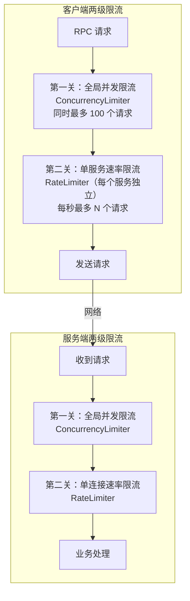
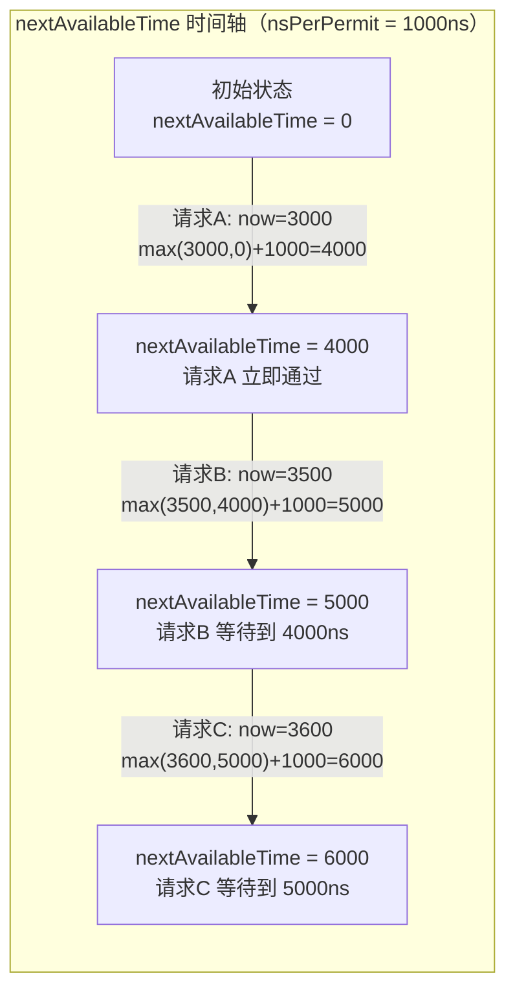

# 第 7 篇：限流器 — 令牌桶 + CAS 无锁实现

> 上一篇讲了多节点场景下如何选路和自救（负载均衡 + 重试）。这一篇讲如何防患于未然：限流，防止请求把服务压垮。

---

## 为什么需要限流

想象这样一个场景：你的服务每秒能处理 1000 个请求，正常运行得很好。某天来了一次大促，流量瞬间涨到每秒 5000 个请求。服务处理不过来，请求开始排队，响应时间变慢，调用你服务的上游系统也开始超时堆积，然后上游的上游也开始崩……整条调用链像多米诺骨牌一样倒下。这就是**雪崩效应**。

用餐厅来类比：餐厅不限座位数，客人挤满了，服务员忙不过来，所有人都等很久，最后大家都不满意，差评如潮。

限流就是给餐厅装上一道门槛：**超过承受能力的请求，直接婉拒，而不是全部接进来然后一起崩**。

---

## 两级限流：全局并发 + 单连接速率

这套 RPC 框架实现了两种不同维度的限流，它们解决的问题不同，互为补充。

| 维度 | 限制的是什么 | 类比 |
|------|------------|------|
| **全局并发限流** | 同时处理的请求总数上限 | 餐厅总座位数，坐满了就在门口等 |
| **单连接速率限流** | 每个连接每秒最多发多少请求 | 每张桌子每分钟最多点 N 道菜，下单太快直接拒绝 |

两者结合，才能全面保护服务端：既限制了"同时有多少请求在飞"，又限制了"新请求涌入的速度"。



---

## ConcurrencyLimiter：基于 Semaphore 的并发控制

并发限流器的实现非常简洁，核心是 Java 的 `Semaphore`（信号量）：

```java
public class ConcurrencyLimiter implements Limiter {
    private final Semaphore semaphore;

    public ConcurrencyLimiter(int permits) {
        this.semaphore = new Semaphore(permits);
    }

    @Override
    public boolean tryAcquire() {
        return semaphore.tryAcquire();  // 非阻塞，拿不到立即返回 false
    }

    @Override
    public void release(int count) {
        semaphore.release(count);
    }
}
```

`Semaphore` 就像停车场闸机：

- 初始化时设定总许可数（停车位总数）
- `tryAcquire()`：尝试拿一个许可（进一辆车）。有位置就成功返回 `true`，没位置立即返回 `false`（不排队等）
- `release()`：归还许可（车离开，空出一个位）

关键点：`tryAcquire()` 是**非阻塞**的。请求进来时，如果并发数已满，立刻返回 `false`，框架直接返回"服务繁忙"，而不是让请求一直挂着等。**快速失败比慢慢超时强得多。**

`acquire()` 和 `release()` 必须成对出现。如果请求处理完了没有 `release()`，许可就"漏"了，可用并发数会越来越少，最终服务自己把自己锁死。

---

## RateLimiter：令牌桶算法的无锁实现

这是本篇的核心。令牌桶是限流领域的经典算法，而这里的实现方式——用一个 `AtomicLong` 代替真实令牌——有着非常精妙的设计，以及一个藏得极深的 bug。

### 令牌桶原理

先不看代码，用图解说清楚：

```
          每秒补充 N 个令牌
                ↓
    ┌───────────────────────┐
    │   🪙 🪙 🪙 🪙 🪙 🪙   │  ← 桶（最多存 MAX 个）
    └───────────────────────┘
                ↓
    请求来了，取走一个令牌，才能通过
    取不到令牌 → 拒绝请求
```

规则很简单：
1. 桶里有令牌，每秒补充 N 个
2. 请求来了，拿一个令牌才能通过
3. 桶满了不再补充（防止长时间空闲后积累大量令牌，导致突发流量失控）

停车场版类比：停车场每小时新增 N 个停车位，进一辆占一个位，离开一辆空一个位，但总位数有上限。高峰期来太多车，车位不够，后来的车直接不让进。

### 用一个 AtomicLong 实现令牌桶

这是设计的精髓。**我们根本不需要真正存储令牌的数量。**

换一个视角：令牌桶等价于一条"时间队列"。每 `nsPerPermit` 纳秒（1秒 / 每秒允许的请求数）才能放行一个请求。如果把每个请求的"预计放行时间"排成一列，整个限流问题就变成了：

> **下一个令牌什么时候可用？**

用一个变量 `nextPermitNs` 记录"下一个令牌可以被取走的时间点"，每来一个请求，就把这个时间点往后推 `nsPerPermit`。

```java
private final AtomicLong nextPermitNs = new AtomicLong(0);
```

计算逻辑的核心一行：

```java
long next = Math.max(now, pre) + nsPerPermit;
```

分两种情况理解：

**情况一：`pre <= now`（桶里有积累的令牌）**

说明上一个令牌的可用时间已经过去了，桶里有余量。此时 `Math.max(now, pre) = now`，所以 `next = now + nsPerPermit`。这个请求立即通过，但把下一个令牌的可用时间推迟了 `nsPerPermit`。

**情况二：`pre > now`（令牌还没生成，需要排队）**

说明请求来得太快，下一个令牌还没就绪。此时 `Math.max(now, pre) = pre`，所以 `next = pre + nsPerPermit`。这个请求要等到 `pre` 时刻，且下一个令牌要等到 `next = pre + nsPerPermit`。请求在时间轴上"排队"，但注意：等待时间如果超过了 `MAX_WAIT_DURATION`（1秒），直接拒绝，不让请求堆积太久。



### CRITICAL bug 解析（重点！）

这是本篇最有价值的内容。这个 bug 曾经真实存在于代码中，修复前后只有一个括号的差别，但效果天壤之别。

**错误写法**：
```java
long next = Math.max(now + nsPerPermit, pre);
```

**正确写法**：
```java
long next = Math.max(now, pre) + nsPerPermit;
```

两者看起来很像，但含义完全不同。用具体数字推导：

---

**假设**：`nsPerPermit = 1000`，当前时间 `now = 3000`，上次记录的时间点 `pre = 5000`（说明队列里已经有请求在排队，`pre > now`）

**错误写法的计算过程**：

```
next = Math.max(now + nsPerPermit, pre)
     = Math.max(3000 + 1000, 5000)
     = Math.max(4000, 5000)
     = 5000
```

`next = 5000 = pre`，时间窗口**没有推进**！

这意味着：这次请求把 `nextPermitNs` 从 `5000` 更新成了 `5000`——什么都没变。下一个请求读到的 `pre` 还是 `5000`，它还能用同样的计算方式得到 `next = 5000`，照样通过！**相当于这次请求白拿了一个令牌，没有消耗任何"时间配额"。**

这个漏洞会让限流完全失效：当 `pre > now` 时，即排队压力最大的时候，所有请求都能绕过限制。

---

**正确写法的计算过程**：

```
next = Math.max(now, pre) + nsPerPermit
     = Math.max(3000, 5000) + 1000
     = 5000 + 1000
     = 6000
```

`next = 6000 > pre = 5000`，时间窗口**正确推进**了 `nsPerPermit`。

这次请求把 `nextPermitNs` 从 `5000` 更新成了 `6000`，下一个请求最早要等到 `6000` 时刻。限流按预期工作。

```mermaid
graph TB
    subgraph "❌ 错误写法：Math.max(now + nsPerPermit, pre)"
        E1["now=3000, pre=5000, nsPerPermit=1000"]
        E2["now + nsPerPermit = 3000 + 1000 = 4000"]
        E3["Math.max(4000, 5000) = 5000"]
        E4["next = 5000 = pre<br/>⚠️ 时间窗口没有推进！"]
        E5["限流失效：请求没有消耗等待时间"]
        E1 --> E2 --> E3 --> E4 --> E5
    end

    subgraph "✅ 正确写法：Math.max(now, pre) + nsPerPermit"
        C1["now=3000, pre=5000, nsPerPermit=1000"]
        C2["Math.max(3000, 5000) = 5000"]
        C3["5000 + nsPerPermit = 5000 + 1000 = 6000"]
        C4["next = 6000 > pre<br/>✅ 时间窗口正确推进"]
        C5["限流正常：下一个令牌推迟 1000ns"]
        C1 --> C2 --> C3 --> C4 --> C5
    end
```



---

**为什么这个 bug 很隐蔽？**

低并发下，请求稀疏，`pre <= now` 几乎总是成立（令牌随时可用）。此时：
- 错误写法：`Math.max(now + nsPerPermit, pre) = now + nsPerPermit`（因为 `now + nsPerPermit > pre`）
- 正确写法：`Math.max(now, pre) + nsPerPermit = now + nsPerPermit`（因为 `now >= pre`）

**两者结果完全一样！** 低并发下，这个 bug 永远不会暴露。只有高并发下（`pre > now`，多个请求同时排队），两种写法才会产生不同结果，而错误写法会直接让限流失效。

这类 bug 单测很难覆盖，只有在真实高并发压测中才会现出原形。

### CAS 无锁机制

现在有一个新问题：在高并发下，多个线程同时读到同一个 `pre`，然后都计算出了 `next`，然后一起更新 `nextPermitNs`——这不乱套了吗？

这正是 `AtomicLong` 的 `compareAndSet`（CAS）要解决的问题：

```java
for (int i = 0; i < MAX_ATTEMPTS; i++) {
    long pre = nextPermitNs.get();
    long next = Math.max(now, pre) + nsPerPermit;

    if (next - now > MAX_WAIT_DURATION) {
        return false;
    }

    // CAS：只有当 nextPermitNs 的当前值还是 pre 时，才把它更新成 next
    // 如果期间有其他线程抢先更新了，这次 CAS 失败，重试
    if (nextPermitNs.compareAndSet(pre, next)) {
        return true;
    }
    // CAS 失败，重新读取 pre，重新计算
}
return false;  // 重试次数耗尽，拒绝
```

`compareAndSet(pre, next)` 的语义是：

> "如果现在的值是 `pre`，就把它改成 `next`，返回 `true`；如果已经不是 `pre` 了（被别人改了），什么都不做，返回 `false`。"

这是一个 CPU 级别的原子操作，不需要加锁。对比 `synchronized`：

| | synchronized | CAS |
|---|---|---|
| 竞争时 | 其他线程**阻塞等待** | 其他线程**重试** |
| 开销 | 线程切换、内核态开销大 | 仅 CPU 指令级别，极快 |
| 适用场景 | 写多、竞争激烈 | 短操作、高性能场景 |

为什么 `MAX_ATTEMPTS = 512`？在极端高并发下，CAS 竞争可能很激烈，一个线程可能连续输给其他线程。设定最大重试次数，是一道兜底保护：与其让请求在 CAS 循环里自旋消耗 CPU，不如超过阈值后直接拒绝。**限流的目的就是保护系统，无限重试会适得其反。**

---

## 服务端限流：LimiterServerHandler

了解了两种限流器的原理，再看它们如何在服务端协同工作。

`LimiterServerHandler` 是 Netty Pipeline 里的一个 Handler，所有入站请求都要经过它：

```java
private class LimiterServerHandler extends ChannelDuplexHandler {

    @Override
    public void channelRead(ChannelHandlerContext ctx, Object msg) throws Exception {
        Request request = (Request) msg;

        // ========== 第一级：全局并发限流 ==========
        if (!globalLimiter.tryAcquire()) {
            log.warn("全局并发限流触发，拒绝请求: {}", request.getRequestId());
            Response response = Response.fail("服务繁忙，请稍后重试（全局并发限制）", request.getRequestId());
            ctx.writeAndFlush(response);
            return;
        }

        // ========== 第二级：channel 速率限流 ==========
        Limiter limiter = ctx.channel().attr(ATTR_KEY_LIMITER).get();
        if (!limiter.tryAcquire()) {
            log.warn("全局速率限流触发，拒绝请求: {}", request.getRequestId());
            globalLimiter.release();  // 释放已获取的全局许可，避免资源泄漏
            Response response = Response.fail("服务繁忙，请稍后重试（速率限制）", request.getRequestId());
            ctx.writeAndFlush(response);
            return;
        }

        ctx.channel().attr(ATTR_KEY_GLOBAL_COUNTER).get().incrementAndGet();
        ctx.fireChannelRead(msg);  // 通过限流，传给下一个 Handler
    }

    @Override
    public void write(ChannelHandlerContext ctx, Object msg, ChannelPromise promise) throws Exception {
        promise.addListener((ChannelFutureListener) future -> {
            int count = ctx.channel().attr(ATTR_KEY_GLOBAL_COUNTER).get().getAndDecrement();
            if (count > 0) {
                ctx.channel().attr(ATTR_KEY_LIMITER).get().release();
                globalLimiter.release();  // 响应发出后，归还全局并发许可
            }
        });
        ctx.write(msg, promise);
    }

    @Override
    public void channelActive(ChannelHandlerContext ctx) throws Exception {
        // 每个连接建立时，创建独立的速率限流器
        ctx.channel().attr(ATTR_KEY_LIMITER).set(new RateLimiter(properties.getServiceLimit()));
        ctx.channel().attr(ATTR_KEY_GLOBAL_COUNTER).set(new AtomicInteger(0));
        ctx.fireChannelActive();
    }
}
```

**两级限流的触发时机和设计细节**：

1. **先检查全局并发**：如果已经有太多请求"在飞"，立即拒绝。这是最快的保护，开销最小。

2. **再检查速率**：每个连接有独立的 `RateLimiter`，通过 Netty 的 `AttributeKey` 绑定到 Channel 上。连接建立时创建，连接关闭时自动销毁。这样每个客户端的速率是独立计算的，一个疯狂发请求的客户端不会影响其他客户端。

3. **速率限流失败时要释放全局许可**：注意这行代码 `globalLimiter.release()`。如果速率限流触发，这个请求会被拒绝，但它此前已经通过了全局并发限流（拿了一个许可）。**必须把这个许可还回去**，否则全局并发计数器会一直下降，最终死锁。

4. **响应发出后才释放**：全局并发许可在 `write()` 方法的监听器里释放，而不是请求通过限流检查后立即释放。这确保了"正在处理中"的请求始终占用着并发配额，直到响应真正发出去，才算一次完整的请求处理结束。

5. **连接异常断开时兜底释放**：`channelInactive()` 里检查还有多少未完成请求，统一释放全局并发许可，防止连接异常时资源泄漏。

### 设计追问

**Q: 客户端和服务端都做限流，不是重复了吗？**

不重复，各自保护的目标不同。

- **服务端限流**：保护服务端自己，防止被任何来源的请求打垮。即使客户端没有做限流，甚至是恶意客户端，服务端也能自保。
- **客户端限流**（如果有的话）：保护客户端自己不要发太多请求，比如防止客户端线程池被大量积压的请求耗尽，或者在知道服务端有压力时主动减少发送。

两者是互补关系：服务端限流是"最后一道防线"，客户端限流是"主动配合"。只有服务端有限流时系统也是安全的；只有客户端有限流时，如果有多个客户端或者恶意请求，服务端依然可能被打垮。

---

## 大白话总结

想象一个停车场，每天都有很多车来。停车场老板想了两招来防止停车场被挤爆：

**第一招：总车位限制。** 停车场一共只有 100 个位。满了就在门口立一个牌子"车位已满，请勿进入"，来的车直接走人，不让进来等。这样停车场里的车永远不会超过 100 辆，不会乱。

**第二招：入场速度限制。** 为了防止某辆车一口气订下 50 个位置（比如某个大客户批量派人来），每辆车进场前，收费员会看一个"入场许可本"——本子上记着"下一辆车最早几点几分能进场"。如果现在还没到那个时间，就让车在门外等一小会儿；等太久（超过 1 分钟）就直接拒绝，让车去别处停。

**收费员的记账方式很聪明。** 他不用真的数停车场里有多少空位，只需要记一个数字：**"下一辆车什么时候可以进场"**。每进来一辆车，这个时间就往后推一小格。停车场很空时，这个时间一直是"现在就能进"；车多了，这个时间就会越推越远，来车就需要等。

收费员记这个数字的时候，面临一个挑战：同时来了很多车，助手们（多个助手）都在帮他更新这个数字，怎么保证不乱？

他的解决方案：每个助理更新数字时，先确认一下"这个数字还是我刚才看到的那个吗？"——如果是，就更新；如果已经被别的助理改掉了，就重新读最新的数字，重新算，再试一次。这样不需要把所有助理都赶出去（加锁），大家各自重试，速度很快。

最后，当一辆车离场时，要做两件事：在入场许可本上不用改（时间自己会到来），但要把总车位计数减一，让下一辆等候的车知道"有位了"。如果停车场突然停电（连接断开），还没离场的车也要统一清点，把占用的位置全部腾出来，防止停车场永远显示"已满"。

这两道关卡——总量限制 + 速度限制——让停车场在任何情况下都不会被挤爆，也不会让某个大客户独占资源。

---

*下一篇：第 8 篇 — 熔断器：当某个服务持续出问题时，如何自动断开对它的调用，给它喘息时间。*
