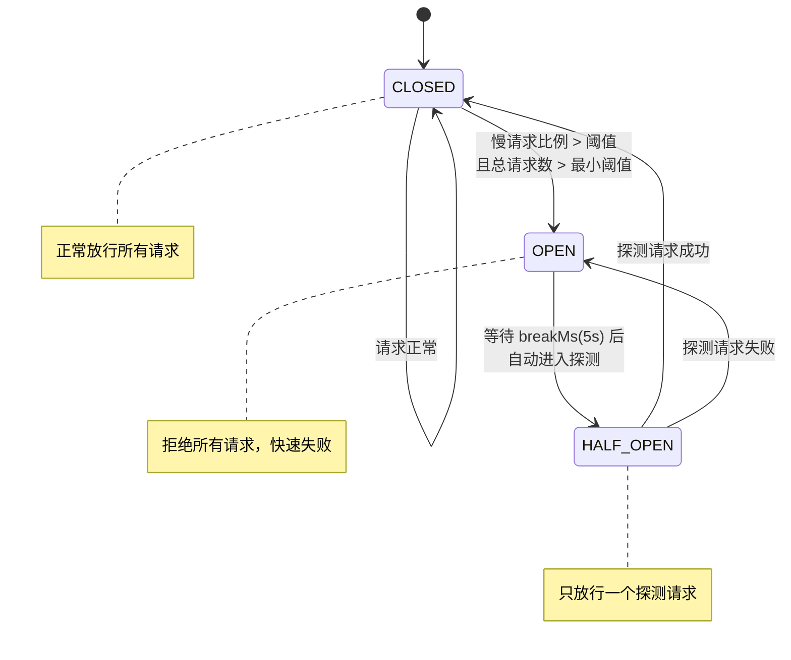
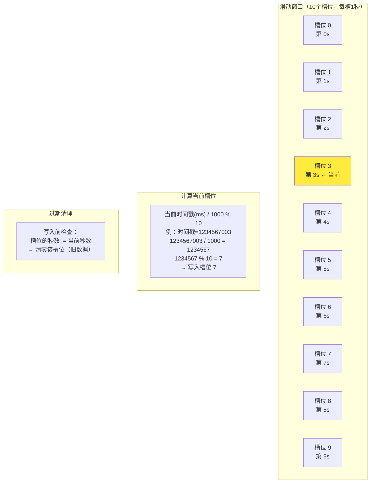
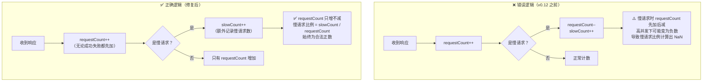

# 第 8 篇：熔断器 — 滑动窗口 + 三态自动机

> 上一篇讲了如何限制请求速率。这一篇讲当某个服务已经出问题时，如何自动"断开"对它的调用，避免拖垮整个系统。

---

## 熔断器解决什么问题

先从生活场景出发。家里的配电箱里有一排空气开关（保险丝）。正常情况下开关合上，电流畅通，电器正常工作。如果某个电器短路，电流瞬间暴增，空气开关"啪"地跳闸，切断这条支路——其他电器还在正常用电，只有出问题的那条支路断开了。

等你排查完原因、修好电路，再把开关拨回去，一切恢复正常。

熔断器在分布式系统里干的就是这件事：

| 状态 | 类比 | 行为 |
|------|------|------|
| **CLOSED（闭合）** | 开关合上，电路通 | 正常接收请求 |
| **OPEN（断开）** | 开关跳闸，电路断 | 拒绝所有请求，立即返回错误 |
| **HALF_OPEN（半开）** | 试着把开关拨回去 | 放一个请求进去探测，看服务有没有恢复 |

### 为什么不能"一直重试"

如果一个服务已经过载或者宕机，持续往它发请求只会让情况更糟：

1. 服务本来勉强还能处理一点请求，结果被大量重试请求淹没，彻底崩溃
2. 请求在调用方这边排队等待，占用内存和线程
3. 调用方响应变慢，它的调用者也开始超时……整条调用链雪崩

熔断器的策略是：**发现服务不健康，立刻停止发请求，给它喘息时间**。等一段时间后再用一个"探测请求"确认服务恢复，才重新开放流量。这和空气开关跳闸后你不能无脑一直拨，要先排查问题才能合闸，是同一个道理。

---

## 三态自动机

熔断器的核心是一个三个状态的状态机，状态之间的转换有明确的触发条件。

```
                    慢请求比例 > 阈值
                    且 总请求数 >= 5
         ┌─────────────────────────────────┐
         │                                 ▼
       CLOSED                            OPEN
         ▲                                 │
         │  探测请求成功                    │  等待 breakMs（默认 5s）
         │                                 ▼
         └──────────────────────────── HALF_OPEN
                                          │
                                          │ 探测请求仍然失败
                                          ▼
                                        OPEN（重新计时）
```



逐条解释每条边：

### CLOSED → OPEN：触发熔断

在 `processClosedState` 方法里，每收到一个慢请求（响应时间超过阈值，或调用失败），就计算当前滑动窗口内的慢请求比例：

```java
double failedRatio = ((double) totalFailedCount) / totalRequestCount;
if (failedRatio > slowRequestRatioThreshold
        && state.compareAndSet(State.CLOSED, State.OPEN)) {
    lastBreakTime = System.currentTimeMillis();
}
```

用 `compareAndSet` 做状态切换，保证并发下只有一个线程能成功触发熔断，同时记录熔断时间。

### OPEN → HALF_OPEN：等待冷却后探测

在 `allowRequest()` 里判断：

```java
long now = System.currentTimeMillis();
return now - lastBreakTime > breakMs
        && state.compareAndSet(State.OPEN, State.HALF_OPEN);
```

等待 `breakMs`（默认 5 秒）后，第一个调用 `allowRequest()` 并且 CAS 成功的请求会把状态切换到 `HALF_OPEN`，这个请求被放行作为探测请求。注意 `HALF_OPEN` 状态下其他请求仍然被拒绝：

```java
if (State.HALF_OPEN.equals(state.get())) {
    return false;   // 探测请求只放一个
}
```

### HALF_OPEN → CLOSED 或 HALF_OPEN → OPEN：根据探测结果决定

`processHalfOpenState` 方法：

```java
private void processHalfOpenState(boolean isSlowRequest) {
    if (isSlowRequest && state.compareAndSet(State.HALF_OPEN, State.OPEN)) {
        lastBreakTime = System.currentTimeMillis(); // 重新计时，再等 5s
    } else {
        state.compareAndSet(State.HALF_OPEN, State.CLOSED); // 探测成功，完全恢复
    }
}
```

探测请求如果还是慢，重新回到 OPEN 并刷新计时；探测请求正常，切回 CLOSED，恢复正常服务。

### 设计追问

**Q1: 为什么需要 HALF_OPEN？直接从 OPEN 恢复到 CLOSED 有什么风险？**

直接恢复的风险是"假恢复"。服务可能只是短暂地空闲了一下，实际上根本问题没有解决。如果直接切到 CLOSED，大量积压的请求瞬间涌入，服务再次过载，状态重新变 OPEN，形成反复震荡。

HALF_OPEN 相当于"小流量探测"：只放一个请求进去，这个请求的结果作为"服务是否真正恢复"的判断依据。成功了才完全打开，失败了重新计时再等待。

---

## 滑动窗口统计

这是本篇的技术核心。

### 为什么用滑动窗口

**Q2: 为什么用滑动窗口而不是全量统计？**

全量统计有"历史数据污染"的问题。假设 1 小时前服务不稳定，产生了 200 个慢请求。现在服务完全恢复正常了，但全量统计里那 200 个历史慢请求还在，慢请求比例显示 60%，熔断器永远不会恢复。

滑动窗口只统计最近 10 秒的数据，旧数据自动过期，能及时反映服务的**当前**状态。

### 环形数组实现

`ResponseTimeCircuitBreaker` 用一个长度为 10 的数组实现滑动窗口，每个槽位对应 1 秒：

```java
private final long breakRecordDuration = 10000;  // 10 秒
private final long slotDuration = 1000;          // 1 秒 / 槽
private final SlotData[] slots = new SlotData[(int)(breakRecordDuration / slotDuration)]; // 10 个槽
```

**环形复用的关键公式**：

```
槽位下标 = (当前时间戳毫秒 / 1000) % 10
```

时间不断增长，但取模之后只在 0-9 之间循环，旧槽位会被新数据覆盖。

下面是某一时刻的内存示意图：

```
时间轴：  ...  t=0  t=1  t=2  t=3  t=4  t=5  t=6  t=7  t=8  t=9  t=10 ...
                                                                       ↑ 当前秒 (currentIndex=0，复用槽0)

slots 数组（10个槽位，下标 0-9）：
┌────┬────┬────┬────┬────┬────┬────┬────┬────┬────┐
│ 0  │ 1  │ 2  │ 3  │ 4  │ 5  │ 6  │ 7  │ 8  │ 9  │  ← 槽位下标
├────┼────┼────┼────┼────┼────┼────┼────┼────┼────┤
│t10 │ t1 │ t2 │ t3 │ t4 │ t5 │ t6 │ t7 │ t8 │ t9 │  ← 这个槽记录哪秒的数据
└────┴────┴────┴────┴────┴────┴────┴────┴────┴────┘
  ↑
  当前正在写入（t=10秒，10%10=0，覆盖了 t=0 的旧数据）
```

**清除过期数据**是 `slideWindowIfNecessary` 的职责。时间每前进一秒，就把"下一个"槽位清零（因为那个槽位存的是 10 秒前的旧数据）：

```java
int diff = (int) ((now - currentIndexStartTime) / slotDuration);
int step = Math.min(diff, slots.length);
for (int i = 0; i < step; i++) {
    int index = (currentIndex + i + 1) % slots.length;
    slots[index].getRequestCount().set(0);  // 清零旧数据
    slots[index].getFailedCount().set(0);
}
currentIndex = (currentIndex + step) % slots.length;
```

举例：当前 `currentIndex=3`，时间前进了 2 秒（`step=2`），清除槽位 4 和 5（10 秒前的数据），`currentIndex` 移动到 5。

整个统计始终是 10 个槽位的汇总，代表最近 10 秒的情况。



### CRITICAL Bug 解析

这是 v0.12 修复的一个严重 bug。

**原始错误逻辑（伪代码）**：

```java
// 旧版本 processClosedState（有 bug）
slotData.requestCount.incrementAndGet();   // +1 总请求
if (isSlowRequest) {
    slotData.requestCount.decrementAndGet(); // -1 总请求 ← BUG！
    slotData.failedCount.incrementAndGet();  // +1 慢请求
}
```

当一个慢请求进来时：先 +1 再 -1，最终 `requestCount` 净增量为 0。如果多个线程同时处理慢请求，`requestCount` 甚至可能变成负数（先 +1 再 -1，另一个线程的 -1 可能让总数低于 0）。

**后果**：

```
failedRatio = totalFailedCount / totalRequestCount
```

如果 `totalRequestCount` 为 0 或负数，结果是 `NaN`、`Infinity` 或负数，`failedRatio > threshold` 的条件永远不会正确触发，**熔断器形同虚设**。

**修复后的正确逻辑**：

```java
// 修复后（当前版本）
slotData.requestCount.incrementAndGet(); // 无论成功失败，都先 +1 总请求

if (!isSlowRequest) {
    return; // 快请求，不做额外统计
}

slotData.failedCount.incrementAndGet(); // 慢请求，再 +1 慢请求数
// 计算比例…
```

`requestCount` 单调递增，不会出现为零或负数的情况，慢请求比例的计算始终正确。



**Q3: 为什么需要最小请求数阈值？**

防止"小样本误判"。假设服务刚启动，只有 1 个请求，而这个请求恰好响应慢（可能是 JVM 在做 JIT 编译），慢请求比例 = 100%，熔断器立刻触发。但这不代表服务真的有问题。

最小请求数（`minRequestCountThreshold = 5`）确保：必须在滑动窗口内至少有 5 个请求，才开始评估慢请求比例。样本量不够，就先积累数据，不做判断。

```java
if (totalRequestCount < minRequestCountThreshold) {
    return; // 样本不足，不触发熔断
}
```

---

## CircuitBreakerFactory：为什么熔断器需要工厂

读到这里你可能有个疑问：之前的负载均衡器、限流器都可以直接用 SPI 加载一个单例对象，为什么熔断器要额外搞一个 Factory 接口？

原因在于**有状态 vs 无状态**的区别：

| 组件 | 状态 | 能否单例复用 |
|------|------|------------|
| `LoadBalancer`（负载均衡器） | 无状态，每次调用只看当前服务列表 | 可以，SPI 直接加载单例 |
| `RateLimiter`（限流器） | 有状态，持有令牌桶的当前令牌数 | 每个 RPC 接口独立一个 |
| `CircuitBreaker`（熔断器） | 有状态，持有滑动窗口的 10 个槽位 + 三态状态机 | 每个**服务节点**独立一个 |

熔断器必须为每个服务节点（`ServiceMateData`）创建独立实例，因为不同节点的故障是独立的——节点 A 过载不代表节点 B 也有问题，不能共用同一个滑动窗口。

解决方案是两层 SPI：

```
SPI 加载 CircuitBreakerFactory（无状态，只有一个工厂实例）
         │
         │ factory.create(slowRequestThresholdMs, slowRequestRatioThreshold)
         ▼
CircuitBreaker（有状态，每个服务节点一个独立实例）
```

`CircuitBreakerManager` 用 `ConcurrentHashMap` 维护节点到熔断器实例的映射：

```java
public CircuitBreaker getOrCreateBreaker(ServiceMateData serviceMateData) {
    return breakerMap.computeIfAbsent(serviceMateData, k -> createBreaker());
}
```

`ResponseTimeCircuitBreakerFactory` 标注了 `@SpiTag("responseTime")`，通过 `ServiceLoader` 自动发现，配置文件里写 `circuitBreakerType=responseTime` 就能切换熔断器实现，不需要改代码。

Factory 模式在这里解决的核心问题是：**SPI 机制天然产生单例，但我需要的不是单例，而是"按需创建有状态实例"的能力**——工厂负责这个桥接。

---

## 大白话总结

想象你家里的配电箱，里面有好几个空气开关，每条支路一个。

**正常情况**，所有开关都合着，家里电器正常用。

**某天电热水器坏了**，里面线路短路，电流蹿上去。对应这条支路的空气开关感应到异常，"啪"一声跳闸了。这条支路断了，但其他支路——客厅的灯、电视、冰箱——还好好的，没受影响。这就相当于熔断器从"正常"变成"断开"。

**跳闸之后你能做什么？** 你不能一直反复把开关拨回去——如果根本问题没解决，拨回去立刻又跳，反复冲击说不定把开关本身都烧坏了，还可能引发更大故障。正确做法是等一会儿，先排查一下，确认问题解决了再合闸。这就是为什么断开之后要等一段时间（5 秒），然后才进入"试试看"的状态。

**"试试看"的状态**，你小心地把开关拨回一半，如果没有立刻再次跳闸，说明可以完全合上；如果一合上就又跳，说明还没好，继续等。

**为什么需要等这"试试看"的环节**，而不是直接完全恢复？因为刚好停了几秒，电器里的热量散了一点，你以为好了，结果刚通电又短路。"试试看"就是用一次小小的尝试确认真的恢复了，再完全放开，避免一恢复就又崩。

**为什么统计要只看最近 10 秒而不是所有历史？** 就像你家空气开关——如果 1 小时前跳过一次但已经修好了，你不会因为"历史上跳过"就一直让开关保持断路状态。它只关心**现在**这条支路有没有问题，历史的事已经过去了。

**为什么需要至少 5 次才判断**？假设你刚装修完，第一次给某条支路通电，恰好那天的电压有点波动，稍微过了一点点上限，开关跳了一次。你不会因为这一次就断定这条支路有根本性的问题——也许只是偶然，再试几次就知道了。积累了足够多的样本，才能判断是真的有问题还是偶然意外。

---

*下一篇：降级机制 — 当熔断器断开时，如何优雅地返回兜底结果，而不是直接报错。*
