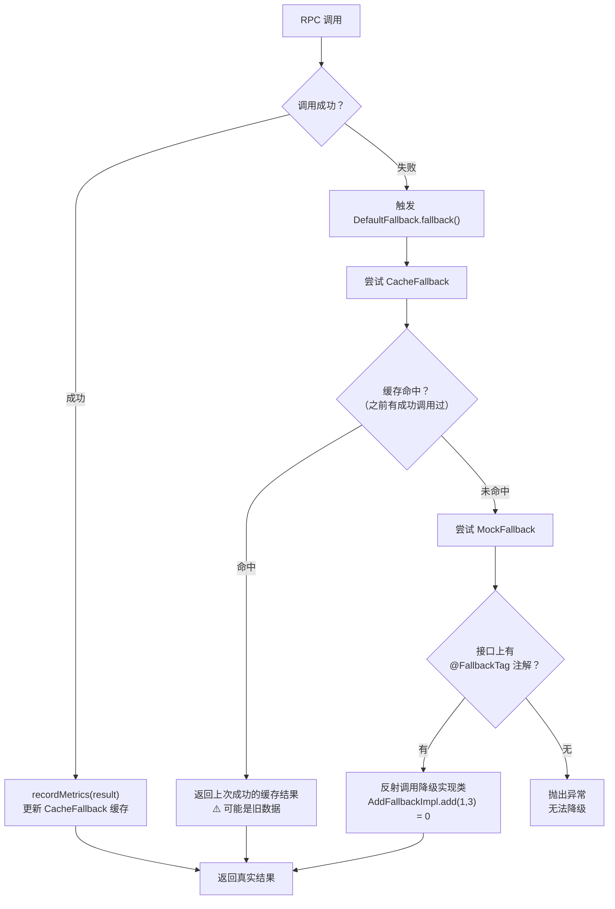

# 第 9 篇：降级 + 泛化调用 + 流量统计 + 演进总结

> 上一篇讲了熔断器如何在服务不健康时自动断开调用、给服务喘息时间。这是系列的最后一篇，讲最后一道防线（降级），两个实用工具（泛化调用、流量统计），以及整个框架从 v0.1 到现在的演进反思。

---

## 降级：最后一道防线

整个 RPC 框架到目前为止已经有了很多道保护：限流器拦住了超额请求，熔断器断开了反复失败的连接，重试机制给了失败请求多次机会。但这些机制都有一个共同的终态——**失败**。

限流拒绝了请求，熔断器把所有节点都断开了，重试也全部耗尽——这时候怎么办？直接把异常抛给调用方，调用方再抛给用户，用户看到一个报错页面？

这就是**降级**要解决的问题：当正常调用路径全部失败时，给出一个"差强人意"的兜底结果，让系统至少还能给出一个响应，而不是直接崩溃。

降级是最后一道防线，它的目标不是"完美"，而是"有总比没有好"。

---

### 降级链：DefaultFallback → CacheFallback → MockFallback

来看代码。这里有三个类，它们通过责任链的方式串联起来。

**先看入口 `DefaultFallback`**：

```java
@Override
public Object fallback(MetricsData metricsData) throws Exception {
    try {
        return cacheFallback.fallback(metricsData);
    } catch (Exception e) {
        log.warn("缓存未命中，方法：{}，参数：{}", metricsData.getMethod().getName(), Arrays.toString(metricsData.getArgs()));
    }
    return mockFallback.fallback(metricsData);
}
```

逻辑非常清晰：先试缓存，缓存没命中就试 Mock。两级降级，失败自动往下走。

**第一级：`CacheFallback`（缓存降级）**

```java
@Override
public Object fallback(MetricsData metricsData) {
    CacheKey cacheKey = new CacheKey(metricsData.getMethod(), metricsData.getArgs());
    Object result = resultCache.get(cacheKey);
    if (result == NULL) {
        return null;
    }
    if (result == null) {
        throw new RpcException("缓存未命中");
    }
    return result;
}

@Override
public void recordMetrics(MetricsData metricsData) {
    CacheKey cacheKey = new CacheKey(metricsData.getMethod(), metricsData.getArgs());
    Object result = metricsData.getResult();
    if (result == null) {
        result = NULL;
    }
    resultCache.put(cacheKey, result);
}
```

这里有一个细节值得注意：`resultCache` 用了一个特殊的哨兵对象 `NULL`（`private static final Object NULL = new Object()`）来区分"缓存了 null 值"和"缓存未命中"。

为什么需要这个区分？因为有些方法本来就会返回 `null`（比如查询不存在的记录返回 null），如果把这个 `null` 直接存进 Map，用 `map.get(key) == null` 就无法判断到底是"缓存里没有"还是"缓存里存的就是 null"。哨兵对象解决了这个歧义。

缓存的 key 是 `CacheKey`，由**方法 + 参数列表**共同构成，并重写了 `equals` 和 `hashCode`（用 `Arrays.deepEquals` 处理数组参数）。这意味着同一个方法用不同参数调用，会分别缓存各自的结果。

`recordMetrics` 在每次调用成功后被调用，把这次的结果存进缓存，为未来的降级做准备。

**第二级：`MockFallback`（Mock 降级）**

```java
@Override
public Object fallback(MetricsData metricsData) throws Exception {
    Method method = metricsData.getMethod();
    Class<?> declaringClass = method.getDeclaringClass();
    FallbackTag annotation = declaringClass.getAnnotation(FallbackTag.class);
    if (annotation == null) {
        throw new RuntimeException("未找到消费者降级方法实现");
    }

    Class<?> value = annotation.value();
    if (!declaringClass.isAssignableFrom(value)) {
        throw new RuntimeException("消费者降级方法实现不匹配");
    }
    Object invoker = invokerCache.computeIfAbsent(value, this::createMockInvoker);
    return method.invoke(invoker, metricsData.getArgs());
}
```

Mock 降级的逻辑是：找到方法所在的接口，读取接口上的 `@FallbackTag` 注解，注解里指定了一个"降级实现类"，然后反射调用这个类的对应方法。

`invokerCache` 会缓存已经创建的实例，避免每次降级都反射创建对象。

整个降级链的流程就是：
1. RPC 调用成功 → `recordMetrics` 把结果存入 `CacheFallback`
2. RPC 调用失败触发降级 → `DefaultFallback.fallback()` 先尝试 `CacheFallback`
3. 缓存命中 → 返回上次的结果
4. 缓存未命中 → 尝试 `MockFallback`，通过注解找到降级实现类，调用其方法
5. 降级实现类也没有 → 抛出异常，告知调用方无法降级



---

### 设计追问

**Q1: 缓存降级和 Mock 降级各自适合什么场景？**

缓存降级适合"结果变化不大"的场景。比如查询用户基本信息（姓名、头像），如果服务挂了返回上次查到的结果，用户大概率感知不到差异——反正用户名和头像不会一秒换一次。这种场景下缓存降级体验非常好，用户甚至不知道后台出了问题。

但缓存降级有个前提：**必须有历史成功调用**。如果某个接口从来没有被成功调用过（比如第一次请求就遇到故障），`resultCache` 里没有任何数据，缓存降级就无从谈起。

Mock 降级适合"需要固定兜底值"的场景。比如推荐系统挂了，与其返回上次的个性化推荐（那个结果现在可能已经过时，或者依赖了当时的用户状态），不如返回一个预先准备好的默认推荐列表——比如"热门商品 Top 10"。这个列表是事先写在代码里的，稳定可控，不依赖任何历史状态。

两者结合（`DefaultFallback`的设计）是最佳实践：先利用缓存，缓存没有再用 Mock，最大化地利用已有信息，同时保底。

**Q2: `@FallbackTag` 为什么用注解而不是配置文件？**

注解的优点是**就近声明**。降级实现类的信息直接写在服务接口上：

```java
@FallbackTag(AddFallbackImpl.class)
public interface Add {
    int add(int a, int b);
}
```

看接口就知道降级方案是什么，不需要翻别的地方。接口、降级实现、注解三者放在一起，内聚性很好。

配置文件的优点是**运行时可修改**，可以在不重启服务的情况下切换降级策略。但这个框架目前的降级策略不需要动态切换——降级实现类的逻辑相对稳定，不会因为线上流量变化而改变。既然不需要动态切换，注解更简洁，也减少了维护配置文件的负担。

如果未来需要动态切换，可以把注解作为默认值，允许配置文件覆盖——两者不是非此即彼的关系。

---

## 泛化调用：不需要接口类的 RPC

来看这个简洁到极致的接口：

```java
public interface GenericConsumer {
    Object $invoke(String serviceName, String methodName, String[] paramTypes, Object[] args);
}
```

方法名里有个 `$`，这是有意为之——普通 Java 方法名不会有 `$`，这让它在反射和序列化时不会和业务方法产生冲突。

这四个参数完整描述了一次 RPC 调用：
- `serviceName`：要调用哪个服务
- `methodName`：调用这个服务的哪个方法
- `paramTypes`：方法的参数类型（字符串形式，如 `"int"`、`"java.lang.String"`）
- `args`：实际的参数值

用法对比一下就很清楚了：

普通动态代理的调用方式（需要在编译时引入接口 jar）：
```java
Add addService = ConsumerProxyFactory.createConsumerProxy(Add.class);
int result = addService.add(1, 2);
```

泛化调用（不需要任何接口类）：
```java
GenericConsumer consumer = ...; // 获取泛化调用客户端
Object result = consumer.$invoke("add-service", "add", new String[]{"int", "int"}, new Object[]{1, 2});
```

---

### 使用场景：为什么需要不依赖接口类的 RPC？

**场景一：API 网关**

API 网关负责把外部 HTTP 请求转发到内部 RPC 服务。问题是：一个公司可能有几百个微服务，每个服务都有自己的接口 jar。如果网关要引入所有服务的接口 jar，依赖管理会变成灾难——光是 pom.xml 就会写成几百行，而且每次有服务改了接口，网关也要跟着改依赖、重新编译。

用泛化调用，网关只需要接收 HTTP 请求里的 `serviceName/methodName/args` 参数，然后直接发起 RPC，完全不依赖接口类。

**场景二：测试平台**

测试人员想测试某个 RPC 服务，一般的做法是写测试代码，引入接口 jar，调用方法。但如果有一个 Web 测试平台，让测试人员在页面上填写"服务名/方法名/参数"就能发起调用，效率会高很多。这个测试平台后端就用泛化调用来实现 RPC 请求的发送。

---

### 设计追问

**Q: 泛化调用和动态代理的区别是什么？**

动态代理（`ConsumerProxyFactory.createConsumerProxy(Add.class)`）的本质是：**在运行时生成一个实现了 `Add` 接口的代理对象**。你调用 `addService.add(1, 2)` 的时候，编译器知道 `add` 方法存在，知道参数是两个 `int`，知道返回值是 `int`——这是编译时的类型安全。如果你传错了参数，编译阶段就会报错。

泛化调用完全放弃了编译时的类型约束，全程用字符串和 Object 来描述调用信息。好处是不需要接口类，任何服务都能调；坏处是类型错误只有在运行时才会暴露——如果你把 `"int"` 写成了 `"Integer"`，或者参数个数传错了，编译器不会告诉你。

两者各有适用场景，不存在谁替代谁的问题：
- 业务代码里用动态代理，享受类型安全和 IDE 自动补全
- 平台/网关/测试工具用泛化调用，享受灵活性

---

## 流量统计：TrafficRecordHandler

来看 `TrafficRecordHandler`：

```java
public class TrafficRecordHandler extends ChannelDuplexHandler {

    private TrafficRecord trafficRecord;
    private ScheduledFuture<?> trafficRecordFuture;

    @Override
    public void write(ChannelHandlerContext ctx, Object msg, ChannelPromise promise) throws Exception {
        if (msg instanceof ByteBuf byteBuf) {
            trafficRecord.getUpCounter().getAndAdd(byteBuf.readableBytes());
        }
        ctx.write(msg, promise);
    }

    @Override
    public void channelRead(ChannelHandlerContext ctx, Object msg) throws Exception {
        if (msg instanceof ByteBuf byteBuf) {
            trafficRecord.getDownCounter().getAndAdd(byteBuf.readableBytes());
        }
        ctx.fireChannelRead(msg);
    }

    @Override
    public void channelActive(ChannelHandlerContext ctx) throws Exception {
        trafficRecord = new TrafficRecord();
        trafficRecordFuture = ctx.channel().eventLoop().scheduleAtFixedRate(() -> {
            log.info("上行流量：{} bytes，下行流量：{} bytes",
                trafficRecord.getUpCounter().get(), trafficRecord.getDownCounter().get());
        }, 5, 5, TimeUnit.SECONDS);
        ctx.fireChannelActive();
    }

    @Override
    public void channelInactive(ChannelHandlerContext ctx) throws Exception {
        if (trafficRecordFuture != null) {
            trafficRecordFuture.cancel(false);
        }
        ctx.fireChannelInactive();
    }

    @Data
    public static class TrafficRecord {
        private final AtomicLong upCounter = new AtomicLong();
        private final AtomicLong downCounter = new AtomicLong();
    }
}
```

这里有几个值得拆开说的设计点。

**`ChannelDuplexHandler`：同时拦截两个方向**

普通的 `ChannelInboundHandler` 只处理入站（接收到的数据），普通的 `ChannelOutboundHandler` 只处理出站（要发送的数据）。`ChannelDuplexHandler` 同时继承了两者，可以在同一个 Handler 里拦截 `write`（出站）和 `channelRead`（入站）。

流量统计需要同时记录上行和下行字节数，用 `ChannelDuplexHandler` 是最简洁的做法——一个类解决两个方向，而不是写两个 Handler。

**关键细节：别忘了往下传**

注意每个方法最后都有一行：
- `write` 里有 `ctx.write(msg, promise)` ← 把数据继续往下发
- `channelRead` 里有 `ctx.fireChannelRead(msg)` ← 把数据继续往下传
- `channelActive` 里有 `ctx.fireChannelActive()` ← 让后续 Handler 也知道连接建立了

如果忘了这些，数据就会被"吞掉"——记录了流量，但数据不再继续处理，整个 RPC 调用就断了。

**生命周期管理**

连接建立（`channelActive`）时创建 `TrafficRecord` 和定时任务；连接断开（`channelInactive`）时取消定时任务。这个对称设计避免了资源泄漏——如果不取消定时任务，连接已经关闭了，定时任务还在每 5 秒打印一次"上行 0 bytes，下行 0 bytes"，白白浪费线程资源。

---

### 设计追问

**Q: 为什么用 `AtomicLong` 而不是普通的 `long`？**

这个问题一开始我也觉得没必要——`TrafficRecordHandler` 不是绑定在一个 EventLoop 线程上吗，单线程操作不需要原子性啊？

仔细想想，情况没那么简单。虽然 Netty 的 IO 操作（`channelRead`、`write`）和定时任务都在同一个 EventLoop 线程上执行，彼此之间不存在并发。但这个 Handler 可能被外部代码从其他线程读取统计数据——比如监控系统定期轮询 `upCounter.get()`，这时候就有"一个线程写、另一个线程读"的并发场景。

普通 `long` 的读写在 64 位 JVM 上不保证原子性（在某些 JVM 实现里，`long` 的高 32 位和低 32 位可能分两次写入），在多线程下可能读到一个"半新半旧"的值。

`AtomicLong` 的 `getAndAdd` 是原子操作，底层用 CAS 保证，即使在多线程下也不会出现数据竞争。既然这是个统计框架，统计数据不准确比多用几纳秒更不可接受，用 `AtomicLong` 是正确选择。

---

## 演进反思：v0.1 → v0.20

读完整个 CHANGELOG，一个规律非常明显：**每次加功能，都是因为上一个版本暴露了新的问题**。

### v0.1~v0.4：能用（解决基础通信问题）

v0.1 是一个能跑起来的最小原型：Netty 建立 TCP 连接，JSON 序列化，自定义二进制协议（魔数校验防止误连接）。这时候框架能做的事情只有一件：在两台机器之间传递一次方法调用。

但"能用"暴露了第一个问题：每次调用都重新建立连接，性能极差。v0.4 加了连接池（`ConnectionManager`），顺便加了 `requestId` 机制来匹配请求和响应——因为连接复用之后，同一个连接上可能有多个请求在飞，没有 requestId 就不知道哪个响应对应哪个请求。

v0.5 加了动态代理，让调用方不用手写 RPC 序列化代码，这是从"框架内部能用"到"调用方用起来方便"的升级。

### v0.5~v0.7：好用（解决生产可用性问题）

动态代理解决了单点调用的问题，但接下来面对的是多实例部署的现实：Provider 有多个节点，Consumer 该怎么选？v0.6 加了 Zookeeper 注册中心，v0.7 加了负载均衡（随机/轮询）。

这个阶段的主要驱动力是：**单机的框架不能用于分布式场景**。注册中心和负载均衡是分布式 RPC 的标配，缺了这两个，框架只是个玩具。

### v0.8~v0.13：稳定（解决故障处理问题）

v0.8 加了重试。为什么加重试？因为网络抖动是常态，一次失败不代表服务真的挂了。但重试引入了新问题：重试多少次？等多久？v0.8 实现了三种策略（同机重试、故障转移、并行重试）来应对不同场景。

v0.9/v0.10 加了限流。为什么加限流？因为重试本身会放大流量——一个请求失败重试 3 次，相当于发了 4 次请求。没有限流，重试机制反而可能加速把下游压垮。这是个典型的"新功能引入新问题"。

v0.12 加了熔断器。为什么加熔断器？因为限流只能保护本服务，但如果下游服务已经彻底挂了，继续发请求（哪怕限了流）也是浪费资源，还会让超时请求堆积。熔断器让框架在下游失败时主动"断开"，等待下游恢复。

v0.13 加了降级。为什么加降级？因为熔断之后请求没地方去，总要有个兜底。

这个阶段的每一步都是：**上一个功能暴露了一个新的故障场景，加新功能来兜底**。

### v0.14~v0.20：可维护（解决可观测性和扩展性问题）

框架稳定了，但又面临新的问题：**怎么知道框架运行得怎么样？怎么让框架更容易扩展？**

v0.14 加了可插拔序列化（Hessian/JSON）和压缩（GZIP/NONE），还修了几个关键 bug。这里有个有意思的现象：功能加得越多，隐藏 bug 被暴露的概率就越大——这也是软件工程的普遍规律。

v0.15 加了心跳机制，检测连接是否还活着。v0.16 加了流量统计，让运维能看到实际传输了多少数据。这两个功能的驱动力都是**可观测性**：框架运行的时候，你得能看到里面发生了什么。

v0.17 加了业务处理线程池，把 IO 线程和业务线程分离。这个改动解决了一个很现实的问题：如果业务处理很慢（比如需要查数据库），会占用 Netty 的 IO 线程，导致其他连接的 IO 也被阻塞。线程池隔离让 IO 和业务互不干扰。

v0.18~v0.20 引入了 SPI 机制，把负载均衡器、注册中心、熔断器等核心组件全部变成了可插拔的扩展点。这是扩展性的飞跃——以前加一个新的负载均衡算法需要改核心代码，现在只需要写一个新的实现类，放进 SPI 配置文件就行了。

```mermaid
graph LR
    subgraph "第一阶段：能用（v0.1~v0.5）"
        P1["v0.1 基础通信"] --> P2["v0.2 反射调用"]
        P2 --> P3["v0.3 超时+响应码"]
        P3 --> P4["v0.4 连接池"]
        P4 --> P5["v0.5 动态代理"]
    end

    subgraph "第二阶段：好用（v0.6~v0.8）"
        P5 --> P6["v0.6 服务发现"]
        P6 --> P7["v0.7 负载均衡"]
        P7 --> P8["v0.8 重试机制"]
    end

    subgraph "第三阶段：稳定（v0.9~v0.13）"
        P8 --> P9["v0.9 限流器"]
        P9 --> P10["v0.10~v0.11 限流集成+资源修复"]
        P10 --> P11["v0.12 熔断器"]
        P11 --> P12["v0.13 降级机制"]
    end

    subgraph "第四阶段：可扩展（v0.14+）"
        P12 --> P13["v0.14 可插拔序列化/压缩"]
        P13 --> P14["SPI 重构<br/>心跳+流量统计<br/>泛化调用"]
    end

    style P1 fill:#e8f5e9
    style P14 fill:#e3f2fd
```



---

### 提炼规律

回头看这个演进路径，有个规律始终如一：**每个版本都在解决上一个版本用起来之后暴露的问题**。

v0.1 能通信了 → 发现连接每次重建，太慢 → v0.4 连接池
连接池有了 → 发现多节点不知道选谁 → v0.6 注册中心
注册中心有了 → 发现单次失败没有重试 → v0.8 重试机制
重试有了 → 发现重试会打垮下游 → v0.9/v0.10 限流
限流有了 → 发现下游彻底挂了还在发请求 → v0.12 熔断
熔断有了 → 发现请求无处可去 → v0.13 降级
降级有了 → 发现扩展新功能要改核心代码 → v0.18 SPI

这就是**迭代式开发的本质**：不是在开始时把所有问题都预见到，而是边做边发现，发现了就修，修完了又发现新的。那些一开始就设计"完美架构"的项目，往往要么烂尾，要么实现出来根本不是当初以为的那样。

真正的设计能力，是在每次发现新问题时，找到一个既解决当前问题又不破坏已有结构的方案。

---

## 费曼检验总结

写完这 9 篇博客，到了做一次诚实盘点的时候。费曼学习法的核心原则是：**如果你不能用简单的话解释清楚，说明你还没真正理解**。

- ✅ 真正理解了：**Netty 的 Pipeline 机制** — 能够清楚说明 Handler 链的执行顺序、入站出站的区别、ctx.fireXxx 的含义，以及如何利用 Pipeline 做横切关注点（流量统计、心跳、编解码）的分离

- ✅ 真正理解了：**动态代理生成 RPC 调用** — 能够解释 `InvocationHandler.invoke` 如何拦截方法调用，把方法名和参数打包成网络请求发出去，再把响应反序列化成返回值

- ✅ 真正理解了：**降级责任链的设计** — CacheFallback 用哨兵对象区分"null 值"和"未命中"，MockFallback 用注解+反射实现解耦，两者串联起来的默认策略

- ✅ 真正理解了：**令牌桶限流的 CAS 实现** — `Math.max(now, pre) + nsPerPermit` 这个公式的含义，以及为什么要用 `now` 而不是 `pre` 来计算下一个令牌时间

- 🔶 理解了大部分，还有疑问：**熔断器的滑动窗口统计** — 环形数组 + 时间槽的数据结构清楚了，但在高并发下多个线程同时更新同一个槽位的原子性保障，还没有细细验证实现细节是否完全正确

- 🔶 理解了大部分，还有疑问：**SPI 机制的类加载细节** — `ServiceLoader` 的基本用法清楚，但涉及到多 ClassLoader 场景（比如 OSGi、Tomcat 的 WebApp ClassLoader）时 SPI 的加载行为，还不确定

- ❌ 还是盲区：**Netty 的内存管理（PooledByteBuf）** — 整个系列里用到 `ByteBuf` 的地方很多，但对于 Netty 的池化内存分配器（`PooledByteBufAllocator`）、引用计数（`refCnt`）、对象池回收的内部机制，基本没有深入研究。流量统计里 `byteBuf.readableBytes()` 这一行用起来是对的，但为什么不需要手动 `release`？这里有很多细节还是黑盒。

- ❌ 还是盲区：**ZooKeeper 的 Watch 机制和 Session 管理** — 服务注册和发现用到了 ZooKeeper，但 ZooKeeper 的 Watch 事件在网络断开重连后是否会丢失、Session 过期后节点自动删除的时机、Curator 是如何自动重连和重新注册 Watch 的，这些生产关键点都还没搞清楚

---

## 如果继续迭代

如果这个框架要继续发展，下面这些是最值得做的方向：

**Protobuf 序列化**

目前支持 JSON（可读性好但体积大）和 Hessian（二进制但跨语言支持有限）。Protobuf 是 Google 开源的二进制序列化格式，相比 Hessian：体积更小、序列化速度更快，而且有完善的跨语言支持（Java/Go/Python/C++ 等都有官方实现）。在高频调用的场景下，序列化效率直接影响吞吐量，Protobuf 是显而易见的下一步。

框架已经有了 SPI 机制，加 Protobuf 只需要写一个新的 `Serializer` 实现类，加几行 SPI 配置，不用动核心代码——这正是 v0.18 引入 SPI 的意义。

**Redis 注册中心**

目前的注册中心是 Zookeeper（通过 Curator 框架）。Zookeeper 的优点是一致性保证强，适合对注册中心可靠性要求极高的场景；缺点是运维成本高，Zookeeper 集群本身需要 3 或 5 个节点，还需要专门的运维知识。

对于中小规模的部署，Redis 是更轻量的选择——很多公司已经有 Redis 集群了，不需要额外维护一套 Zookeeper。Redis 的 Key 过期机制天然适合做服务的健康检查（Provider 定期刷新 Key 的过期时间，挂了 Key 就过期自动注销）。框架已经有 `ServiceRegistry` 接口和 `RedisServiceRegistry` 的 SPI 配置，这个功能已经打好了地基。

**动态限流配置**

目前限流参数（并发上限、速率上限）在代码里是固定的（`ConsumerProperties` 里的默认值）。在生产环境里，流量是动态的——白天高峰期和凌晨的流量差了十几倍，限流阈值应该跟着变。

理想的方案是接入配置中心（像 Meituan 内部的 Lion，或者开源的 Apollo/Nacos），限流参数存在配置中心里，运营或 SRE 在控制台上调整一下数值，几秒内所有实例生效，不需要重新部署服务。这对生产环境至关重要，但需要先解决配置中心的集成问题。

---

## 大白话总结：整个框架是什么

想象一个城市有很多个仓库，每个仓库负责不同的事情。你是一名快递员，工作就是把"客户的订单"送到对应仓库，再把"仓库的回复"带回来交给客户。

**地址簿**：仓库有几十个，你不可能每次挨个门口问"你是哪家？"。于是城市里有了一本公用地址簿，每家仓库开门时都去登记一下自己的地址和负责哪类货物。你送货前先翻地址簿，一下子就知道该去哪里，不用瞎转。

**多路派送**：找到地址后你开车出发。同一时间有很多包裹要送，所以你不是送完一家再送下一家，而是把包裹分给多名同事，大家各走各的路线，同时出发，谁先送到算谁的，这样整体速度快很多。

**遇堵换路**：路上难免堵车。堵了就换条路再试一次，多试几次总能送到。如果某条路今天反复堵，就暂时不走那条路，改走其他路线，避免一直在同一个地方卡死。

**断路保护**：如果某个仓库最近老是关门、或者每次去了都要等很久，系统会自动把它从今天的派送名单里划掉，不再往那边跑——省得每次都白费油、浪费时间。等过一段时间再去试探一次，确认它恢复正常了才重新加回来。

**备用方案**：如果所有仓库都送不到，手里还有一本备忘本，上面写着"送不到的时候，就用上次送成功时留下的那份回执顶一下"，或者"实在不行就给客户一个默认回复，告诉他稍后再来"。总之不让客户拿到一个空手而归的报错。

**收发台账**：整个系统每天都记账：今天往外发了多少包裹、收回来多少回执、哪条路线最繁忙、哪个仓库最慢。万一某天出了问题，翻翻台账就能看出问题从几点开始、影响了多少批货，方便查原因。

这就是这套系统做的全部事情：**有地址簿能找到人，有多路派送不卡单，出问题自动绕开，绕不开有备用兜底，全程有台账可查**。

---

*至此，这个 RPC 框架的费曼学习系列全部完结。从第 1 篇的"一次请求的完整旅程"，到第 9 篇的"兜底与反思"，9 篇博客覆盖了一个 RPC 框架从 0 到可用所需的所有核心模块。*

*费曼学习法的精髓不是把知识写得多复杂，而是诚实地面对"我真的懂了吗"这个问题。那些还是盲区的部分，才是下一轮学习的起点。*
