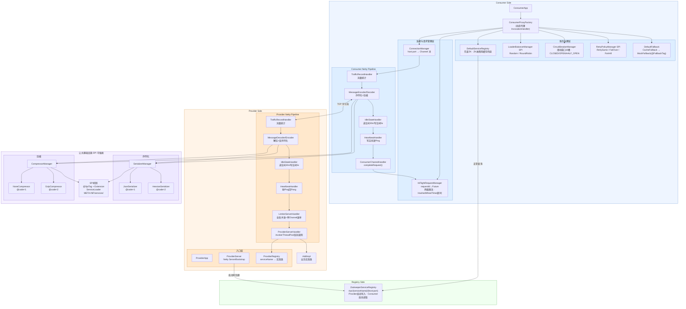

# RPC 框架架构图



## 协议帧格式

```
┌──────────┬──────────┬────────┬───────────┬───────────┬────────┐
│ Length   │ Magic    │ Type   │ Version   │ SACType   │ Body   │
│  (4B)    │  (7B)    │  (1B)  │   (2B)    │   (1B)    │  (NB)  │
└──────────┴──────────┴────────┴───────────┴───────────┴────────┘
Magic = "baichen"    Type: 1=Request  2=Response
SACType 高4位=序列化类型  低4位=压缩类型    ≤256B 自动跳过压缩
```
